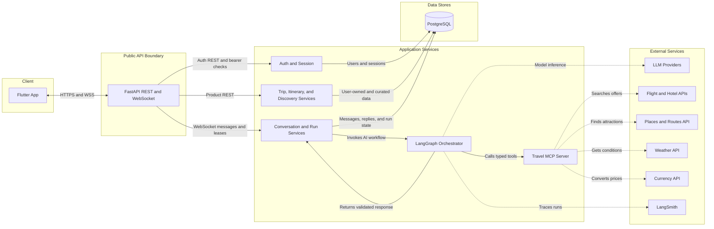
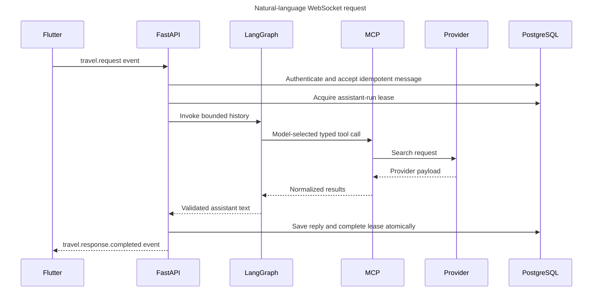

# System Architecture

## Purpose

The system gives a Flutter client a single authenticated interface for travel search and itinerary planning while keeping provider credentials, LLM orchestration, persistence, and policy enforcement on the server.

The implemented service is a modular monolith: FastAPI, LangGraph, and FastMCP share one process but retain separate modules and contracts. FastMCP is called through an in-process client; it is not currently mounted as an HTTP endpoint. This reduces infrastructure cost, while the typed MCP schemas leave a path to a separately deployed transport later.

## Runtime architecture

The diagram is the target architecture. Today, PostgreSQL persistence covers identity, sessions, conversations, messages, assistant-run leases, and trips. Travel search snapshots and itineraries are not yet stored. LangSmith tracing is also not wired.

## Trust boundaries

### Flutter client

The client is untrusted. It MAY format and validate inputs for user experience, but the backend MUST repeat authorization and domain validation. Flutter never receives provider or LLM API keys.

### FastAPI public boundary

FastAPI owns:

- access-token verification and server-session checks;
- REST resource APIs and the authenticated WebSocket handshake;
- request size limits, rate limits, idempotency, and cancellation;
- mapping graph progress into versioned WebSocket events;
- authorization checks before reading or mutating user-owned resources.

### LangGraph orchestration

The graph owns workflow state and decisions. Structured Flutter events route directly to deterministic tool nodes. Natural-language requests use bounded model nodes only for extraction, clarification, or synthesis.

### MCP boundary

MCP exposes provider-independent, typed tools. It owns provider authentication, timeouts, response parsing, and normalization. It does not own user sessions, conversations, trips, or database transactions.

### PostgreSQL boundary

PostgreSQL currently stores normalized identity, session, conversation, message, assistant-run, and trip data in the `app` schema. LangGraph checkpointing and the `langgraph` schema are target work. Repositories and services are the application layers allowed to issue business-data queries.

## Current primary request flow

## Deterministic versus agentic work

The following table is the target routing policy. The current public travel flow is natural-language WebSocket chat and uses an LLM to choose among registered tools; direct structured search endpoints are not implemented.

| Operation | Path |
| --- | --- |
| Flight/hotel form submission | Validate, call MCP, normalize, rank, persist, return. No LLM. |
| Weather or currency lookup | Direct MCP tool. No LLM. |
| Sorting, filtering, pagination | Backend code. No LLM. |
| Natural-language slot extraction | Economy model only if deterministic parsing is insufficient. |
| Multi-day personalized itinerary | Parallel MCP searches followed by one bounded synthesis call. |
| Saved trip retrieval | PostgreSQL query. No LLM unless the user asks for an explanation or modification. |

## Availability and degradation

The bullets below are requirements, not all current capabilities. The current code has provider timeouts, bounded tool rounds, persisted idempotency, a shared graph deadline, and model-vendor fallback. It does not yet have provider retries, shared caches, circuit breakers, or partial itinerary fan-out.

- Provider timeouts are classified separately from model-provider failures.
- Partial travel results MAY be returned when one optional provider fails.
- Model providers use bounded retry, fallback, and circuit-breaking rules.
- No-results is a successful domain outcome, not a system exception.
- Search and model work MUST be cancellable when the user replaces an active request.
- Every side effect MUST use `request_id` as an idempotency key.

## Scaling path

### MVP

- one FastAPI/FastMCP deployment;
- one managed PostgreSQL database;
- one or more Uvicorn workers only when MCP/session behavior is configured for it;
- in-process bounded caches for non-critical data;
- direct LangSmith tracing with production sampling.

### Scale-out

Add Redis only when multiple backend instances require shared cache, WebSocket routing, circuit-breaker state, or distributed rate limiting. Split MCP into a separate deployment only when it needs independent scaling, security ownership, or reuse by multiple applications.

## Security requirements

- Production traffic uses HTTPS/WSS only.
- `/internal/mcp` is private or protected by service authentication.
- Provider and model keys come from a secret manager or injected environment variables.
- Logs and traces redact tokens, personal data, and provider payloads.
- Model reasoning is not sent to Flutter or persisted as a user-visible message.
- A logout or revoked session invalidates new authentication immediately. The current in-memory connection manager closes active sockets only on the same application instance; cross-instance immediate closure requires distributed revocation fan-out.

## Out of scope for the MVP

- charging payment cards;
- purchasing flight or hotel inventory;
- cancellations and refunds;
- supplier reconciliation;
- affiliate accounting;
- multi-provider price arbitration beyond simple normalized comparison.
