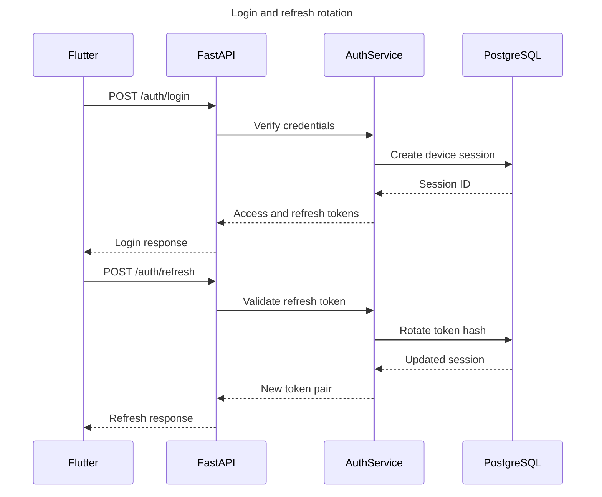

# Authentication and Session Management

## Goals

The Flutter user should remain signed in without repeated login prompts while sessions remain revocable after logout, password reset, account disablement, token theft, or administrator action.

This is achieved with short-lived access tokens and rotating long-lived refresh sessions—not a permanent bearer token.

## Credential model

| Credential | Client storage | Server storage | Purpose |
| --- | --- | --- | --- |
| Access token | Memory | Normally stateless claims plus session lookup/version | Authenticate REST and WebSocket handshakes. |
| Refresh token | iOS Keychain/Android Keystore | Cryptographic hash only | Rotate access credentials without interactive login. |
| WebSocket ticket | Memory, optional | Short-lived one-time record/hash | Authenticate clients that cannot set a handshake header. |

Native Flutter should prefer an `Authorization` handshake header. A future browser client should use an `HttpOnly`, `Secure`, `SameSite` cookie through a backend-for-frontend pattern.

## Login and rotation



Rotation invalidates the previous refresh token. Reuse of an already-rotated token is treated as possible theft and revokes the affected token family or device session.

## Session record

Required fields:

```text
id
user_id
refresh_token_hash
token_family_id
device_id
device_name
created_at
last_used_at
expires_at
rotated_at
revoked_at
revoke_reason
replaced_by_session_id
ip_address
user_agent
```

The application may silently extend an active session according to configured policy. A session is still revoked on explicit logout and security events. "Stay signed in" is a user-experience guarantee, not permission to create a credential that can never expire.

## FastAPI endpoints

| Method | Path | Status | Purpose |
| --- | --- | --- | --- |
| `POST` | `/api/v1/auth/register` | Implemented | Create a user and their first device session. |
| `POST` | `/api/v1/auth/login` | Implemented | Verify credentials and create a new device session. |
| `POST` | `/api/v1/auth/refresh` | Implemented | Rotate the refresh session and return replacement credentials. |
| `POST` | `/api/v1/auth/logout` | Implemented | Revoke the session associated with the current access token. |
| `POST` | `/api/v1/auth/logout-all` | Implemented | Revoke every active session owned by the current user. |
| `GET` | `/api/v1/auth/sessions` | Implemented | List the user's active, unexpired device sessions. |
| `DELETE` | `/api/v1/auth/sessions/{session_id}` | Implemented | Revoke one user-owned device session without disclosing foreign session IDs. |

Endpoint bodies and rate limits are versioned independently from WebSocket events.

### Device-session response

The sessions endpoint returns safe device metadata only. Refresh-token hashes, token-family identifiers, IP addresses, user agents, and revocation reasons are not exposed.

```json
[
  {
    "id": "83d7f01a-1da4-4bf4-b45b-f078613c37a3",
    "device_id": "iphone-device-12345",
    "device_name": "Imran's iPhone",
    "created_at": "2026-08-15T10:00:00Z",
    "last_used_at": "2026-08-15T11:00:00Z",
    "expires_at": "2026-09-14T10:00:00Z",
    "revoked_at": null,
    "is_current": true
  }
]
```

Exactly one returned session should have `is_current=true`: the session that authenticated the request. The repository excludes revoked, rotated, and expired sessions.

## Access-token claims

Minimum claims:

```text
sub          user ID
sid          session ID
iat          issued time
exp          expiration time
iss          configured issuer
aud          configured audience
jti          unique token ID
```

Authorization roles/scopes may be added later. Sensitive profile information does not belong in token claims.

## WebSocket authorization

1. Validate token signature, issuer, audience, and expiry.
2. Verify the referenced user and session are active.
3. Bind the connection to `user_id` and `session_id`.
4. Revalidate long-running connections periodically.
5. Close every connection mapped to a session when it is revoked.
6. Never accept a refresh token as WebSocket authorization.

## Logout behavior

Device logout:

1. Revoke the current server session transactionally.
2. Close mapped WebSocket connections.
3. Delete access/refresh credentials from Flutter secure storage.
4. Return `204 No Content` for the successful revocation request.

After current-device logout, the access token references a revoked session. Retrying the protected logout request with that token returns `401 Unauthorized`; Flutter should treat both the original `204` and a retry-time `401` as a terminal signed-out state and clear local credentials.

Deleting a selected session is ownership-safe and idempotent while the caller's own session remains active. An unknown, already revoked, or different user's session identifier returns `204 No Content` without revealing whether that identifier exists.

Logout-all revokes every active user session and forces all devices to reauthenticate.

## Security events

Require revocation or reauthentication after:

- password reset or recovery;
- email/phone ownership change;
- account disablement;
- refresh-token reuse;
- suspicious device or location policy trigger;
- privilege change;
- confirmed credential exposure.

## Passwords and abuse controls

- Use an established password-hashing algorithm and library with configurable work factor.
- Rate-limit login, registration, refresh, and recovery separately.
- Return non-enumerating login/recovery errors.
- Record security audit events without tokens or passwords.
- Add MFA/passkeys later without changing the session table contract.

## Failure behavior

| Condition | Result |
| --- | --- |
| Access token expired | REST returns 401; Flutter refreshes then retries once. |
| Refresh token valid | Rotate and return a new pair. |
| Refresh token reused | Revoke session family and require login. |
| Session revoked | Reject REST/WebSocket and clear local credentials. |
| Auth database unavailable | Fail closed; do not create an unauthenticated session. |
| Current-device logout retried with its revoked access token | Return 401; Flutter treats the device as signed out. |
| Selected-session deletion repeated by another active session | Return idempotent 204. |

## Data and tracing

Tokens, password material, cookies, authorization headers, and recovery codes are excluded from logs and LangSmith. Security events use opaque identifiers and minimal device metadata with an explicit retention policy.
