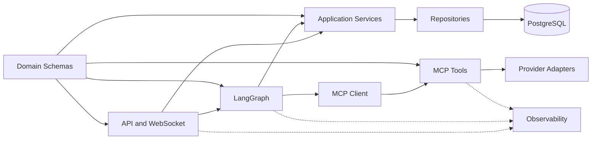

# Backend Structure

## Design goal

The backend is a modular monolith. Modules share one Python project and deployment while enforcing boundaries that allow later extraction into services. Transport, orchestration, provider integration, and persistence must remain independently testable.

## Target tree

```text
app/
├── main.py
├── config.py
├── lifespan.py
├── api/
│   ├── dependencies.py
│   ├── routes/
│   │   ├── auth.py
│   │   ├── trips.py
│   │   ├── conversations.py
│   │   └── health.py
│   └── websocket/
│       ├── travel.py
│       ├── connection_manager.py
│       └── events.py
├── auth/
│   ├── service.py
│   ├── tokens.py
│   ├── passwords.py
│   ├── exceptions.py
│   └── schemas.py
├── graph/
│   ├── builder.py
│   ├── state.py
│   ├── routing.py
│   ├── nodes/
│   │   ├── input.py
│   │   ├── validation.py
│   │   ├── tools.py
│   │   ├── models.py
│   │   ├── persistence.py
│   │   └── responses.py
│   └── subgraphs/
│       ├── model_gateway.py
│       ├── flight_search.py
│       ├── hotel_search.py
│       └── itinerary.py
├── mcp/
│   ├── server.py
│   ├── client.py
│   ├── tools/
│   └── schemas/
├── providers/
│   ├── base.py
│   ├── flights/
│   ├── hotels/
│   ├── places/
│   ├── weather/
│   └── currency/
├── domain/
│   ├── enums.py
│   ├── errors.py
│   ├── flights.py
│   ├── hotels.py
│   ├── places.py
│   └── trips.py
├── services/
│   ├── search_service.py
│   ├── trip_service.py
│   ├── conversation_service.py
│   └── usage_service.py
├── database/
│   ├── base.py
│   ├── session.py
│   ├── models/
│   └── repositories/
├── observability/
│   ├── logging.py
│   ├── langsmith.py
│   └── metrics.py
└── common/
    ├── ids.py
    ├── time.py
    └── exceptions.py
```

Repository-level support:

```text
alembic/          # Alembic environment and revisions
tests/unit/        # Pure domain and node tests
tests/contract/    # Provider and MCP schema fixtures
tests/integration/ # PostgreSQL, FastAPI, MCP, and graph tests
tests/evaluations/ # LangSmith datasets and quality checks
```

## Current implementation status

The directory shape intentionally includes placeholders for later phases. The following files/modules exist but do not yet implement their target use cases:

- REST `conversations.py` and `trips.py` routes;
- trip/search/usage services and trip domain model;
- graph validation and persistence nodes;
- flight, hotel, and itinerary subgraphs;
- LangSmith and metrics adapters;
- trip/search/itinerary repositories and models;
- contract/evaluation suites shown in the target support tree.

The working runtime is authentication plus `/ws/travel`, conversation/message/assistant-run persistence, the bounded model/tool graph, in-process MCP, and configured provider adapters. A file's presence must not be treated as proof that its target capability is complete.

## Dependency direction



The diagram describes compile-time dependency direction, not response direction.

## Module contracts

### `app.api`

May authenticate, validate transport envelopes, invoke services/graphs, and serialize responses. It must not call provider APIs, execute SQL directly, or construct model prompts.

### `app.auth`

Owns password verification, access-token issuance, refresh-token rotation, device sessions, reuse detection, and revocation. It exposes application services rather than framework middleware details.

### `app.graph`

Owns `TravelGraphState`, graph construction, conditional routing, interrupts, deterministic tool orchestration, bounded model calls, and final-response validation. Nodes call services through explicit dependencies; they do not import FastAPI request or WebSocket objects.

### `app.mcp`

`server.py` registers curated travel tools. `client.py` provides the internal graph-facing client. Tool schemas are stable contracts and are versioned when breaking changes are unavoidable.

### `app.providers`

Each provider adapter implements a domain interface. It handles provider authentication, HTTP behavior, rate-limit headers, response parsing, and mapping provider errors into domain errors. Provider payload types never leak into API or graph state.

### `app.domain`

Contains framework-independent Pydantic models, enums, value objects, and domain exceptions. It does not import FastAPI, SQLAlchemy, LangChain, or concrete provider clients.

### `app.services`

Owns business use cases and transaction boundaries: create search, save bounded offer snapshots, build/update trips, append messages, and record usage. Services coordinate repositories but do not know WebSocket event shapes.

### `app.database`

Owns async engine/session creation, SQLAlchemy models, repository implementations, and migrations. Models reflect normalized storage; repositories return domain objects or explicit persistence DTOs.

### `app.observability`

Provides structured logging, LangSmith metadata, metrics, redaction, and correlation helpers. Observability must not change business results when its external destination is unavailable.

## Configuration

`config.py` loads typed settings once through a cached settings factory. Current categories include:

- environment and logging;
- public API and allowed origins;
- database pool and timeout settings;
- access/session token configuration;
- an MCP path reserved for a future network transport;
- provider endpoints, keys, timeouts, and limits;
- model profiles and fallback order;
- LangSmith tracing and sampling;
- retention, maximum result counts, and cost budgets.

Secrets must use secret types and must never appear in `repr`, logs, validation errors, health endpoints, or traces.

## Lifespan ownership

`lifespan.py` currently creates and closes long-lived resources:

1. typed settings;
2. database engine and pool;
3. provider HTTP clients;
4. in-process FastMCP server/client;
5. compiled LangGraph without a checkpointer;
6. WebSocket connection manager;
7. structured logging support; external observability exporters are not initialized.

Request handlers must reuse these clients instead of creating a new HTTP or database client per request.

## Error boundaries

The trees below describe the intended stable taxonomy. Current provider errors are centralized in `app.common.exceptions`, authentication errors in `app.auth.exceptions`, and graph errors in `app.graph.exceptions`; not every target subtype exists yet.

Each lower layer raises typed errors:

```text
ProviderError
├── ProviderRateLimited
├── ProviderUnavailable
├── ProviderAuthenticationFailed
├── OfferExpired
└── LocationNotFound

ModelGatewayError
├── ModelTemporarilyUnavailable
├── ModelQuotaExhausted
├── ModelInvalidRequest
└── ModelOutputInvalid
```

API and graph response nodes map these errors into stable client error codes. Raw exception strings are logged with redaction but not returned to Flutter.

## Import rules

- No circular imports.
- Route modules may import services and graph entry points, not repository implementations.
- Graph nodes may import domain schemas and service protocols, not FastAPI.
- MCP tools may import provider interfaces and domain schemas, not application repositories.
- Provider adapters may import domain types, never graph or API modules.
- SQLAlchemy models remain inside `database` and are not WebSocket response schemas.

These rules should eventually be enforced with architecture tests or a dependency linter.
