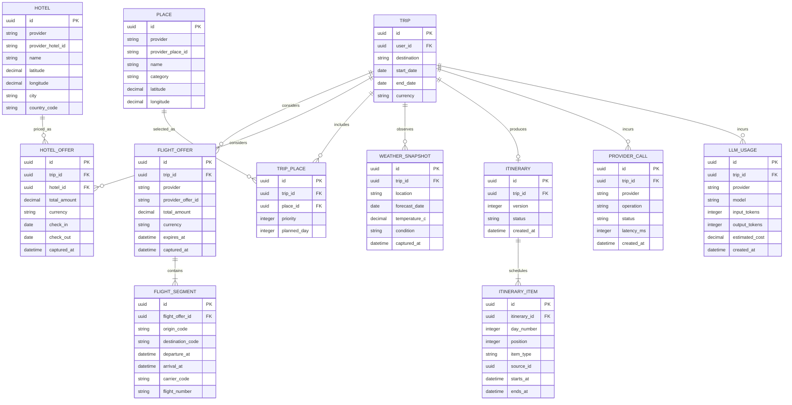

# Database Design

## Purpose

PostgreSQL is the system of record for implemented users, normalized onboarding preferences, curated destinations, authentication sessions, conversations, messages, assistant-run leases, trips, itineraries, and ordered itinerary items. The target model also stores normalized provider results, usage records, and LangGraph checkpoints without coupling workflow state to product tables.

The design targets third normal form for durable business data. Provider payloads may also be retained temporarily as JSONB for debugging and reconciliation, but they are not the primary query model.

## Current migration status

Alembic currently creates thirteen product tables in the `app` schema:

- `users`;
- `user_preferences`;
- `user_interests`;
- `destinations`;
- `destination_styles`;
- `destination_interests`;
- `auth_sessions`;
- `conversations`;
- `messages`;
- `assistant_runs`;
- `trips`;
- `itineraries`;
- `itinerary_items`.

Search-request, flight/hotel/place/weather snapshot, provider-call, LLM-usage, audit, and LangGraph checkpoint tables shown later in this document are target design only.

## Schemas

| Schema | Responsibility |
| --- | --- |
| `app` | Product, authentication, trip, search, and usage tables |
| `langgraph` | LangGraph checkpoints and workflow state |
| `audit` | Optional append-only security and administrative events |

Application roles should receive only the privileges required for their schema. Migration credentials should not be used by the running API.

## Identity and conversation model

```mermaid
erDiagram
    USER ||--o{ AUTH_SESSION : owns
    USER ||--o| USER_PREFERENCE : configures
    USER_PREFERENCE ||--o{ USER_INTEREST : contains
    USER ||--o{ CONVERSATION : starts
    USER ||--o{ TRIP : plans
    CONVERSATION ||--o{ MESSAGE : contains
    TRIP o|--o{ MESSAGE : contextualizes
    TRIP ||--o{ SEARCH_REQUEST : triggers

    USER {
        uuid id PK
        string email UK
        string password_hash
        string status
        datetime created_at
        datetime updated_at
    }
    USER_PREFERENCE {
        uuid user_id PK_FK
        string travel_style
        string budget_tier
        string trip_pace
        string recommendation_scope
        string home_canonical_name
        string home_country_code
        datetime onboarding_completed_at
        datetime created_at
        datetime updated_at
    }
    USER_INTEREST {
        uuid user_id PK_FK
        string interest PK
    }
    AUTH_SESSION {
        uuid id PK
        uuid user_id FK
        string refresh_token_hash UK
        string device_id
        datetime expires_at
        datetime revoked_at
        datetime created_at
    }
    CONVERSATION {
        uuid id PK
        uuid user_id FK
        string title
        datetime created_at
        datetime updated_at
    }
    MESSAGE {
        uuid id PK
        uuid conversation_id FK
        uuid trip_id FK
        uuid client_message_id UK
        uuid reply_to_message_id FK
        string role
        text content
        json structured_content
        datetime created_at
    }
    TRIP {
        uuid id PK
        uuid user_id FK
        string title
        string origin
        string destination
        string origin_location_provider
        string origin_provider_location_id
        string origin_canonical_name
        string origin_country_code
        float origin_latitude
        float origin_longitude
        string destination_location_provider
        string destination_provider_location_id
        string destination_canonical_name
        string destination_country_code
        float destination_latitude
        float destination_longitude
        date start_date
        date end_date
        string status
        datetime created_at
        datetime updated_at
    }
    SEARCH_REQUEST {
        uuid id PK
        uuid trip_id FK
        string search_type
        string status
        jsonb criteria
        datetime created_at
        datetime completed_at
    }
```

## Curated destination catalogue

The implemented Home catalogue is independent of live provider-search results.
`destinations` stores stable card content, geographic data, budget tier,
publication state, and editorial ranks. Styles and interests remain normalized
for indexed querying and controlled vocabulary enforcement.

```mermaid
erDiagram
    DESTINATION ||--o{ DESTINATION_STYLE : supports
    DESTINATION ||--o{ DESTINATION_INTEREST : matches

    DESTINATION {
        uuid id PK
        string slug UK
        string name
        string country_name
        string country_code
        string summary
        string image_url
        string budget_tier
        boolean is_published
        boolean is_featured
        integer featured_rank
        boolean is_popular
        integer popular_rank
        integer editorial_rank
    }
    DESTINATION_STYLE {
        uuid destination_id PK_FK
        string style PK
    }
    DESTINATION_INTEREST {
        uuid destination_id PK_FK
        string interest PK
    }
```

## Travel result model

The itinerary and itinerary-item subset in this section is implemented. Provider
result snapshots and the other search/usage entities remain target schema.

Search results are snapshots. A price must always include its currency, provider, capture time, and applicable conditions because external availability can change immediately.



## Important constraints

Canonical trip locations are optional for backward compatibility, but atomic when
present: provider namespace, provider location ID, canonical name, ISO country
code, latitude, and longitude must all be stored together. Coordinates have
database range checks. The original `origin` and `destination` strings remain as
the user's display/search input; LangGraph prefers the canonical names when they
exist. Changing a route endpoint without replacement metadata clears its stale
canonical location.

User interests are normalized rows keyed by `(user_id, interest)` rather than an
array or JSON document. One optional `user_preferences` row owns scalar choices,
the onboarding completion timestamp, and an atomic provider-qualified home
location. A missing row has the same public meaning as incomplete onboarding.
Local or international recommendation scope requires an explicitly selected home
location at the API boundary; budget alone never determines geographic scope.

- A trip `end_date` must be after its `start_date`.
- A Phase 1 trip status must be `draft`, `planned`, or `archived`; upcoming, active, and history are date-derived views.
- Monetary amounts must be non-negative and paired with an ISO 4217 currency code.
- Flight arrival must be later than departure after timezone normalization.
- One provider entity is unique by `(provider, provider_*_id)`.
- Itinerary positions are unique within a day and itinerary version.
- Refresh tokens are stored only as hashes and are unique.
- Revoked or expired sessions cannot be refreshed.
- All timestamps are stored in UTC; source timezones remain available where travel display requires them.

## Index strategy

Create indexes from measured query patterns, starting with:

- `auth_session(refresh_token_hash)` and `(user_id, revoked_at)`.
- `conversation(user_id, updated_at desc)`.
- `message(conversation_id, created_at)`.
- `trip(user_id, created_at desc)`.
- `search_request(trip_id, search_type, created_at desc)`.
- Offer tables on `(trip_id, captured_at desc)`.
- `itinerary_item(itinerary_id, day_number, position)`.
- `destination(is_published, editorial_rank)` plus curated Featured and Popular
  composite indexes.
- Usage tables on `(trip_id, created_at)` and `(provider, created_at)`.

Avoid indexing arbitrary JSONB until an observed query needs it.

## Transactions and idempotency

- Create a search request and its initial status in one transaction.
- Insert normalized provider results and mark the request complete atomically.
- Use a client-generated idempotency key for commands that may be retried.
- Keep network calls outside long-running database transactions.
- Use row-level locking or optimistic version checks when replacing an itinerary.

## Implemented assistant-response coordination

The implemented conversation baseline includes `app.conversations`, `app.messages`, and `app.assistant_runs`.

- A user message has a client-generated `client_message_id` for idempotent acceptance.
- A user message may reference an owned trip through nullable `trip_id`; assistant messages cannot carry independent trip context.
- Deleting a trip sets message `trip_id` to null so conversation history remains available.
- Reusing `client_message_id` with different content, conversation, or trip context is rejected.
- An assistant message references exactly one user message through `reply_to_message_id`.
- A unique assistant reply per user message prevents duplicate visible responses.
- Assistant messages may store validated bounded `structured_content` for airport clarification. User messages cannot store it, and raw provider payloads are not retained there.
- `assistant_runs` holds one processing lease per user message. A claim token and expiry let only one worker invoke the model.
- Reply creation and run completion commit atomically. A stale worker cannot complete or fail a newer claim.
- Failed runs may be reclaimed only while `attempt_count < MAX_MODEL_ATTEMPTS`; after the cap, the public result is `attempts_exhausted` and no extra model call occurs.

Network/model work happens after the short claim transaction commits. The session is reused only for subsequent reply/failure persistence, so no database transaction is held while awaiting a provider.

## Raw provider payloads

Raw responses can help diagnose parsing problems, but they may contain personal or commercially sensitive data. If retained:

- Store them in a separate table or object store with a short retention period.
- Encrypt them at rest.
- Redact credentials, payment data, and unnecessary traveler details.
- Associate them with `provider_call.id`, not with duplicated business columns.

## Migrations, backup, and retention

- Use Alembic migrations and review generated SQL before deployment.
- Run migrations as a release job, not independently in every API worker.
- Enable automated backups and point-in-time recovery in production.
- Test restoration regularly; an untested backup is not a recovery plan.
- Define retention separately for messages, provider payloads, usage records, and audit events.
- Delete or anonymize user data according to the product privacy policy.

The Cloud SQL configuration reported during the 25 August 2026 review was zonal with automated backups disabled. Treat that database as disposable development infrastructure until high availability, backups, point-in-time recovery, and a restore drill are enabled.

## Connection management

Use an asynchronous PostgreSQL driver through SQLAlchemy, with a bounded application pool. Size the total connections as:

`instances × workers × pool size + operational reserve`

This total must remain below the managed database connection limit. Add a pooler such as PgBouncer when horizontal scaling makes direct connection counts inefficient.
