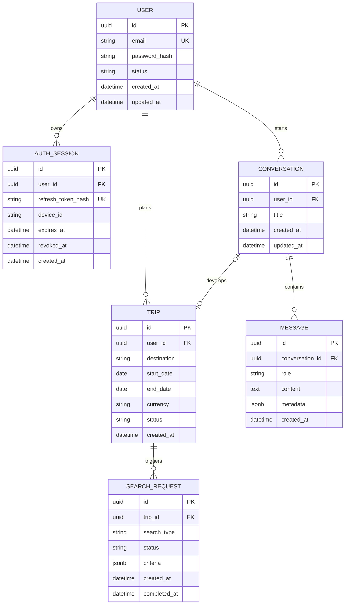

# Database Design

## Purpose

PostgreSQL is the system of record for users, authentication sessions, conversations, trips, normalized provider results, itineraries, and usage records. LangGraph checkpoints use a separate schema so workflow persistence does not become coupled to product tables.

The design targets third normal form for durable business data. Provider payloads may also be retained temporarily as JSONB for debugging and reconciliation, but they are not the primary query model.

## Schemas

| Schema | Responsibility |
| --- | --- |
| `app` | Product, authentication, trip, search, and usage tables |
| `langgraph` | LangGraph checkpoints and workflow state |
| `audit` | Optional append-only security and administrative events |

Application roles should receive only the privileges required for their schema. Migration credentials should not be used by the running API.

## Identity and conversation model

## Travel result model

Search results are snapshots. A price must always include its currency, provider, capture time, and applicable conditions because external availability can change immediately.

## Important constraints

- `end_date` must be on or after `start_date`.
- Monetary amounts must be non-negative and paired with an ISO 4217 currency code.
- Flight arrival must be later than departure after timezone normalization.
- One provider entity is unique by `(provider, provider_*_id)`.
- Itinerary positions are unique within a day and itinerary version.
- Refresh tokens are stored only as hashes and are unique.
- Revoked or expired sessions cannot be refreshed.
- All timestamps are stored in UTC; source timezones remain available where travel display requires them.

## Index strategy

Create indexes from measured query patterns, starting with:

- `auth_session(refresh_token_hash)` and `(user_id, revoked_at)`.
- `conversation(user_id, updated_at desc)`.
- `message(conversation_id, created_at)`.
- `trip(user_id, created_at desc)`.
- `search_request(trip_id, search_type, created_at desc)`.
- Offer tables on `(trip_id, captured_at desc)`.
- `itinerary_item(itinerary_id, day_number, position)`.
- Usage tables on `(trip_id, created_at)` and `(provider, created_at)`.

Avoid indexing arbitrary JSONB until an observed query needs it.

## Transactions and idempotency

- Create a search request and its initial status in one transaction.
- Insert normalized provider results and mark the request complete atomically.
- Use a client-generated idempotency key for commands that may be retried.
- Keep network calls outside long-running database transactions.
- Use row-level locking or optimistic version checks when replacing an itinerary.

## Raw provider payloads

Raw responses can help diagnose parsing problems, but they may contain personal or commercially sensitive data. If retained:

- Store them in a separate table or object store with a short retention period.
- Encrypt them at rest.
- Redact credentials, payment data, and unnecessary traveler details.
- Associate them with `provider_call.id`, not with duplicated business columns.

## Migrations, backup, and retention

- Use Alembic migrations and review generated SQL before deployment.
- Run migrations as a release job, not independently in every API worker.
- Enable automated backups and point-in-time recovery in production.
- Test restoration regularly; an untested backup is not a recovery plan.
- Define retention separately for messages, provider payloads, usage records, and audit events.
- Delete or anonymize user data according to the product privacy policy.

## Connection management

Use an asynchronous PostgreSQL driver through SQLAlchemy, with a bounded application pool. Size the total connections as:

`instances × workers × pool size + operational reserve`

This total must remain below the managed database connection limit. Add a pooler such as PgBouncer when horizontal scaling makes direct connection counts inefficient.
