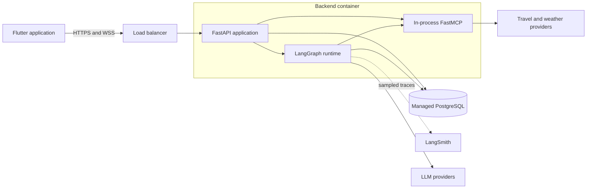
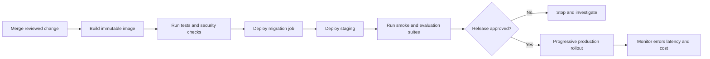

# Deployment Architecture

## MVP topology

Deploy the first production version as a modular monolith: one FastAPI application exposes REST and WebSocket endpoints and initializes FastMCP in process. PostgreSQL remains a separately managed service. The current application does not mount an MCP HTTP route; the graph calls the FastMCP server through an internal Python client.

This boundary is intentionally simple. FastAPI owns public authentication and transport; Flutter never connects directly to MCP or PostgreSQL.

## Environments

Maintain separate local, staging, and production environments with isolated databases and credentials.

| Environment | Purpose | External integrations |
| --- | --- | --- |
| Local | Development and unit/integration tests | Mocks by default; sandbox APIs when needed |
| Staging | Release validation and evaluations | Provider sandbox or restricted production-like access |
| Production | User traffic | Production providers and managed services |

Never copy production secrets or unrestricted personal data into local or staging environments.

## Runtime process

The implemented startup path:

1. Validate configuration without logging secret values.
2. Initialize the async database engine and bounded pool.
3. Create one shared asynchronous HTTP client and configured provider clients.
4. Initialize FastMCP tools, the model gateway, and the compiled LangGraph.
5. Create the process-local WebSocket connection manager.

No LangGraph checkpointer or background worker is currently initialized. Database readiness is checked on demand by `/health/ready`; it does not probe optional travel or LLM providers.

At shutdown, stop accepting new connections, allow bounded request completion, close WebSockets with a retryable code, and release provider and database clients.

## Health endpoints

- `GET /health/live`: implemented; confirms the process event loop is responsive and makes no external calls.
- `GET /health/ready`: implemented; performs a bounded database `SELECT 1`, returning 200 when ready or 503 on failure.
- `GET /health/startup`: optional and not implemented.

Do not make readiness depend on every optional travel provider. Provider health belongs in internal diagnostics and circuit-breaker metrics.

## Release flow

Use backward-compatible database migrations so old and new application versions can overlap during a rolling deployment. Destructive schema cleanup should occur in a later release after all readers have migrated.

## Configuration inventory

Use environment variables or a secret manager for deploy-time configuration. Expected names include:

- `APP_ENV`, `LOG_LEVEL`, `PUBLIC_BASE_URL`
- `DATABASE_URL`
- `JWT_SIGNING_KEY`, `ACCESS_TOKEN_TTL_MINUTES`, `REFRESH_TOKEN_TTL_DAYS`
- `GROQ_API_KEY`, `GOOGLE_API_KEY`, `OPENAI_API_KEY`
- `MODEL_TIMEOUT_SECONDS`, `TRAVEL_RESPONSE_TIMEOUT_SECONDS`, `MAX_TOOL_ROUNDS`
- `ASSISTANT_RUN_LEASE_SECONDS`, `ASSISTANT_RUN_COMPLETION_MARGIN_SECONDS`
- `WEATHER_API_KEY`, `GOOGLE_PLACES_API_KEY`, and `DUFFEL_API_KEY`
- `FLIGHT_PROVIDER`, `HOTEL_PROVIDER`, `PLACES_PROVIDER`, and `CURRENCY_PROVIDER`
- `DUFFEL_API_VERSION`, `DUFFEL_SUPPLIER_TIMEOUT_MS`, and `DUFFEL_STAYS_RADIUS_KM`
- `LANGSMITH_API_KEY`, `LANGSMITH_PROJECT`, `LANGSMITH_TRACING`,
  `LANGSMITH_ENDPOINT`, `LANGSMITH_TRACING_SAMPLING_RATE`
- Route-specific model configuration and request budget settings

Do not commit real values. Rotate any credential that has appeared in source code, chat, logs, screenshots, or shell history.

LangSmith tracing is disabled unless explicitly enabled. Store
`LANGSMITH_API_KEY` in Secret Manager, set the project name, then set
`LANGSMITH_TRACING=true`. Inputs and outputs are hidden by the application
tracer; only run metadata and correlation identifiers are retained there.
Structured `application_metric` entries are written to stdout and ingested by
Cloud Logging. Define log-based counter metrics for `travel_graph_runs`,
`model_provider_attempts`, and `mcp_tool_calls`, and distribution metrics for the
corresponding `*_duration_ms` names. Alert on error/invalid outcomes and elevated
p95 duration. Include `timeout` outcomes in failure alerts; keep external
`cancelled` outcomes separate. Keep `trace_id`, `conversation_id`, and `client_message_id` out of
metric labels; they remain in individual structured log records for investigation.

For local debugging, use `LANGSMITH_PROJECT=travel-assistant-local` and
`LANGSMITH_ENDPOINT=https://api.smith.langchain.com`. These settings are loaded
from `.env` as well as process environment variables. Never commit the API key.
`LANGSMITH_TRACING_SAMPLING_RATE` accepts 0 through 1 and defaults to 1 (all
traces); 0.1 samples approximately 10% of traces. Sampling reduces volume but
does not enforce a monthly budget.

Before sending traces under a free-only budget, configure LangSmith's
**Settings > Billing and Usage > Usage limits** with a zero-spend limit and
base retention (14 days). If configuring counts, keep total traces within
the account's remaining free allowance and disallow extended-retention traces.
Usage from other projects also counts. Do not enable paid upgrades,
evaluation/retention automations, or LangSmith deployments for this setup.
The application does not configure or verify billing limits; a project name
is not a spending cap. Check current
[pricing](https://www.langchain.com/pricing) and
[usage-limit instructions](https://docs.langchain.com/langsmith/billing).

## Network and transport security

- Terminate TLS at a trusted load balancer or ingress and use HTTPS/WSS externally.
- If an MCP network transport is added, restrict it so it is not a public unauthenticated tool endpoint.
- Apply explicit CORS rules to browser clients; native Flutter still relies on token authentication.
- Authenticate the WebSocket during connection setup and authorize every user-scoped operation.
- Apply body-size, message-size, rate, and connection limits.
- Give provider clients strict timeouts and outbound allow-listing where the platform supports it.
- Encrypt PostgreSQL connections and storage.

## PostgreSQL deployment

### Neon development deployment (September 2026)

The restored database is in Neon project `tiny-mouse-51917897`, branch
`production`, database `neondb`, at Alembic revision `b7e2f9a41063`.
The September 10 backup and the September 11 media-import snapshot were restored;
image binaries remain in Google Cloud Storage.

Rollout completed on September 12: Cloud Run revision
`travel-assistant-api-neon-20260912` serves 100% of traffic using image digest
`sha256:07f4ed17ba94dc0d1bbf559d80532337713bd2993a4f341cfb4b66a2f2ac5207`.
Tagged-revision and public-URL checks passed: liveness/readiness and onboarding
returned 200; unauthenticated destination requests returned 401 as required.
The full suite passed 1,544 tests with one environment-dependent skip; that
PostgreSQL integration test also passed when run separately with PostgreSQL 18.
The application engine and built Linux container both passed live pooled-Neon
schema reads. Authenticated Flutter end-to-end testing remains a user task.

Use `DATABASE_CONNECTION_MODE=url` and the pooled Neon `DATABASE_URL` at runtime.
Cloud Run receives the URL through a pinned Secret Manager version of
`neon-database-url`; never place the URL in the deployment YAML or command line.
Standard `postgres://`, `postgresql://`, and `postgresql+asyncpg://` schemes are
accepted. Use `sslmode=verify-full`: the engine verifies the certificate and
hostname using the certifi CA bundle. `sslmode=require` is also upgraded to full
verification. asyncpg does not support libpq's `channel_binding` URL option;
configuration containing it fails explicitly rather than silently ignoring it.
The runtime URL has this unsupported option removed, with verified TLS retained.

Connection establishment and commands have bounded configurable timeouts
(`DATABASE_CONNECT_TIMEOUT_SECONDS=15`, `DATABASE_COMMAND_TIMEOUT_SECONDS=30`).
Cloud Run keeps the small 3+2 connection pool and 10-second readiness deadline.
No periodic database pings are added; readiness runs only when requested.

For Alembic and backups, supply a **direct/unpooled** URL through the process
environment, not the runtime pooled URL. Run migrations as a separate authorized
operation; container startup does not mutate the schema. Schema migrations may
need a longer explicitly selected command timeout.

Deploy the immutable image with `--no-traffic --tag=neon-check`, remove the old
Cloud SQL attachment and database-password reference from the new revision, then
verify the tagged revision's `/health/live` and `/health/ready` before switching
traffic. Preserve all other provider/auth secret references and IAM settings.
Keep request-based billing, minimum instances 0 and maximum instances 1.

The old Cloud SQL revision is **not a working database rollback** while its
instance is suspended. Prefer a forward fix against Neon; restoring older data
requires separate approval. The current development runtime uses `neondb_owner`;
a restricted application role remains required before a multi-user production
launch. The Cloud Run and Neon regions currently differ, so cross-region database
latency remains a known limitation; region migration is a separate decision.

Prefer a managed PostgreSQL service with automated backups, point-in-time recovery, monitoring, and TLS. Maintain separate `app` and `langgraph` schemas as described in [Database Design](database.md).

> **Current infrastructure finding (reported during the 25 August 2026 review):** the selected Cloud SQL instance was zonal and automated backups were disabled. That is acceptable only for disposable development data. It is a production release blocker because one zone/storage incident can cause downtime or data loss. Recheck the live setting rather than assuming this document remains current.

Run Alembic as a single release job. The API identity should have data access but not schema-owner privileges. Monitor connection use, slow queries, replication/storage health, and backup completion.

## Scaling path

Start with one application instance if traffic permits. The next safe steps are:

1. Make every command idempotent and keep durable workflow state in PostgreSQL.
2. Add more stateless API instances behind the load balancer.
3. Route reconnecting WebSockets using persisted conversation/run identifiers.
4. Add Redis only when shared ephemeral state is actually required for fan-out, rate limiting, caching, or coordinated circuit breakers.
5. Split workers or MCP services into separate deployments only after profiling shows a clear isolation or scaling need.

Do not keep authoritative trip or session state only in process memory.

The current connection registry is process-local. Until revocation fan-out and durable work execution exist, run a single application instance/worker if immediate cross-device WebSocket logout and in-flight request continuity are required. See [Reliability and SPOF Review](reliability.md).

## Observability

Collect structured logs, metrics, and traces with a shared request/run correlation ID. At minimum monitor:

- REST and WebSocket request rate, latency, and error category.
- Active WebSocket connections and reconnect frequency.
- Graph-node duration and terminal outcomes.
- Provider latency, rate limits, failures, and open circuits.
- Model tokens, estimated cost, fallback rate, and schema failures.
- Database connections, transaction latency, and slow queries.

Logs must redact authorization headers, cookies, credentials, and sensitive request fields.

## Rollback and recovery

- Keep the previous immutable image available for application rollback.
- Prefer roll-forward database fixes; never automatically reverse a migration that could discard data.
- Document provider-disable switches and model-route overrides.
- Exercise database restoration and session-signing-key rotation procedures.
- Define a degraded mode that can return saved trips when external search providers are unavailable.

## Development catalogue deployment — 11 September 2026 UTC

- Project/service: `travel-assistant-505317` / `travel-assistant-api`, region `asia-south1`.
- Revision: `travel-assistant-api-catalogue-20260911`, serving 100% of main traffic.
- Build: `f7d413aa-3b36-4769-8291-13c46405a7d0` (successful).
- Immutable image: `asia-south1-docker.pkg.dev/travel-assistant-505317/travel-assistant/api@sha256:49b77b2d480a77ac9856aac9f15974c3859b2bc54a32d86f08bcfe7055e554da`.
- API: <https://travel-assistant-api-kg7jnlrcoq-el.a.run.app>.
- The build included the current uncommitted catalogue implementation. No Git
  commit was created; the image digest identifies this deployed artifact.
- Runtime resources, environment/secret references, service identity, concurrency,
  timeout, and revision maximum scale were compared with the previous revision
  and remained unchanged: 1 CPU, 1 GiB memory, concurrency 10, max 1 instance.
- Live database revision was verified as `b7e2f9a41063`; no migration ran during
  deployment. The earlier media import remains in place.
- The candidate was tested with zero main traffic before promotion. Its temporary
  `catalogue-check` traffic tag was removed after promotion.
- Validation: 1531 tests passed in the standard suite, with the opt-in PostgreSQL
  test initially skipped. That test was then run separately against a disposable
  local PostgreSQL 18 cluster and passed. Ruff lint and formatting checks passed.
- Candidate and main URL smoke checks: `/health/live`, `/health/ready`, and
  `/api/v1/onboarding/options` returned 200; all four destination route schemas
  appeared in OpenAPI. Unauthenticated destination calls correctly returned 401.
- Authenticated end-to-end Flutter requests were not exercised: use an existing
  login session for the next client integration check. No test user or forged
  authentication token was created for this deployment.

The older `travel-assistant-api-00003-nqp` image is retained, but is not a verified
rollback target for the expanded catalogue schema. Do not blindly switch back:
the catalogue migration removed legacy destination image columns. Prefer a
schema-compatible replacement revision; never downgrade the live DB automatically.

## Complete catalogue import — 13 September 2026 PKT

- Neon production advanced from `b7e2f9a41063` to `f3a9c2d7e641` after an
  expiring 0.25-CU branch passed upgrade, downgrade, and re-upgrade.
- Production now contains 27 destinations, 108 places, 256 media assets, 27
  destination-media links, and 219 place-media links. Every published destination
  and place has an active cover.
- The public GCS bucket contains 246 immutable objects: 22 existing and 224 new.
  All new objects passed anonymous MIME, CORS, and full SHA-256 delivery checks.
- Two byte-identical gallery copies were omitted (Uluwatu Temple and British
  Museum); their local originals were not deleted.
- Backup `neon-neondb-20260913-pre-catalogue.dump` was validated with
  `pg_restore --list` before production migration.
- No Cloud Run deployment was required because the deployed API already reads
  catalogue tables dynamically. The live readiness endpoint remained healthy.
