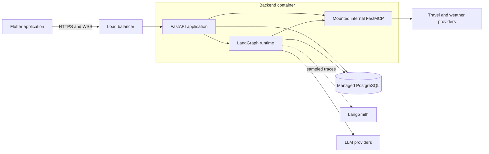
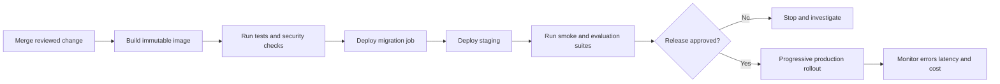

# Deployment Architecture

## MVP topology

Deploy the first production version as a modular monolith: one FastAPI application exposes REST and WebSocket endpoints and mounts the internal FastMCP application. PostgreSQL remains a separately managed service.

This boundary is intentionally simple. FastAPI owns public authentication and transport; Flutter never connects directly to MCP or PostgreSQL.

## Environments

Maintain separate local, staging, and production environments with isolated databases and credentials.

| Environment | Purpose | External integrations |
| --- | --- | --- |
| Local | Development and unit/integration tests | Mocks by default; sandbox APIs when needed |
| Staging | Release validation and evaluations | Provider sandbox or restricted production-like access |
| Production | User traffic | Production providers and managed services |

Never copy production secrets or unrestricted personal data into local or staging environments.

## Runtime process

At application startup:

1. Validate configuration without logging secret values.
2. Initialize the async database engine and bounded pool.
3. Initialize LangGraph checkpointer and model/provider clients.
4. Mount or initialize FastMCP tools.
5. Start background maintenance loops only when leader ownership is defined.
6. Report readiness after required dependencies are usable.

At shutdown, stop accepting new connections, allow bounded request completion, close WebSockets with a retryable code, and release provider and database clients.

## Health endpoints

- `GET /health/live`: confirms the process event loop is responsive; no external calls.
- `GET /health/ready`: checks required initialization and a lightweight database query.
- `GET /health/startup`: optional endpoint for platforms with distinct startup probes.

Do not make readiness depend on every optional travel provider. Provider health belongs in internal diagnostics and circuit-breaker metrics.

## Release flow

Use backward-compatible database migrations so old and new application versions can overlap during a rolling deployment. Destructive schema cleanup should occur in a later release after all readers have migrated.

## Configuration inventory

Use environment variables or a secret manager for deploy-time configuration. Expected names include:

- `APP_ENV`, `LOG_LEVEL`, `PUBLIC_BASE_URL`
- `DATABASE_URL`
- `JWT_SIGNING_KEY`, `ACCESS_TOKEN_TTL_MINUTES`, `REFRESH_TOKEN_TTL_DAYS`
- `GROQ_API_KEY`, `GOOGLE_API_KEY`, `OPENAI_API_KEY`
- `WEATHER_API_KEY` and travel-provider credential names
- `LANGSMITH_API_KEY`, `LANGSMITH_PROJECT`, `LANGSMITH_TRACING`
- Route-specific model configuration and request budget settings

Do not commit real values. Rotate any credential that has appeared in source code, chat, logs, screenshots, or shell history.

## Network and transport security

- Terminate TLS at a trusted load balancer or ingress and use HTTPS/WSS externally.
- Restrict the internal MCP path so it is not a public unauthenticated tool endpoint.
- Apply explicit CORS rules to browser clients; native Flutter still relies on token authentication.
- Authenticate the WebSocket during connection setup and authorize every user-scoped operation.
- Apply body-size, message-size, rate, and connection limits.
- Give provider clients strict timeouts and outbound allow-listing where the platform supports it.
- Encrypt PostgreSQL connections and storage.

## PostgreSQL deployment

Prefer a managed PostgreSQL service with automated backups, point-in-time recovery, monitoring, and TLS. Maintain separate `app` and `langgraph` schemas as described in [Database Design](database.md).

Run Alembic as a single release job. The API identity should have data access but not schema-owner privileges. Monitor connection use, slow queries, replication/storage health, and backup completion.

## Scaling path

Start with one application instance if traffic permits. The next safe steps are:

1. Make every command idempotent and keep durable workflow state in PostgreSQL.
2. Add more stateless API instances behind the load balancer.
3. Route reconnecting WebSockets using persisted conversation/run identifiers.
4. Add Redis only when shared ephemeral state is actually required for fan-out, rate limiting, caching, or coordinated circuit breakers.
5. Split workers or MCP services into separate deployments only after profiling shows a clear isolation or scaling need.

Do not keep authoritative trip or session state only in process memory.

## Observability

Collect structured logs, metrics, and traces with a shared request/run correlation ID. At minimum monitor:

- REST and WebSocket request rate, latency, and error category.
- Active WebSocket connections and reconnect frequency.
- Graph-node duration and terminal outcomes.
- Provider latency, rate limits, failures, and open circuits.
- Model tokens, estimated cost, fallback rate, and schema failures.
- Database connections, transaction latency, and slow queries.

Logs must redact authorization headers, cookies, credentials, and sensitive request fields.

## Rollback and recovery

- Keep the previous immutable image available for application rollback.
- Prefer roll-forward database fixes; never automatically reverse a migration that could discard data.
- Document provider-disable switches and model-route overrides.
- Exercise database restoration and session-signing-key rotation procedures.
- Define a degraded mode that can return saved trips when external search providers are unavailable.
