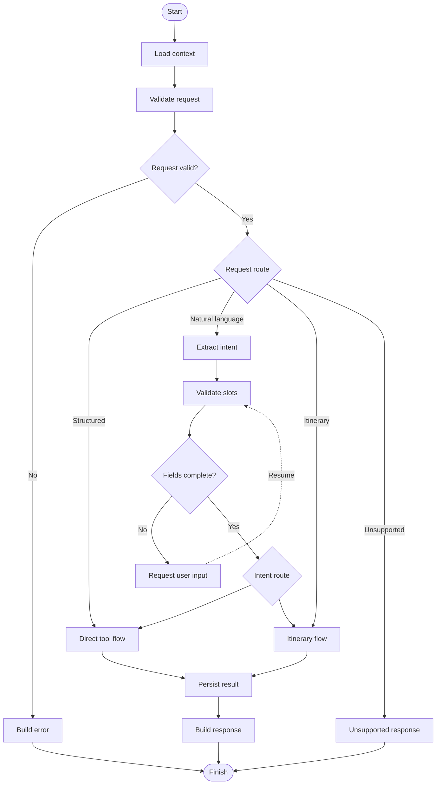
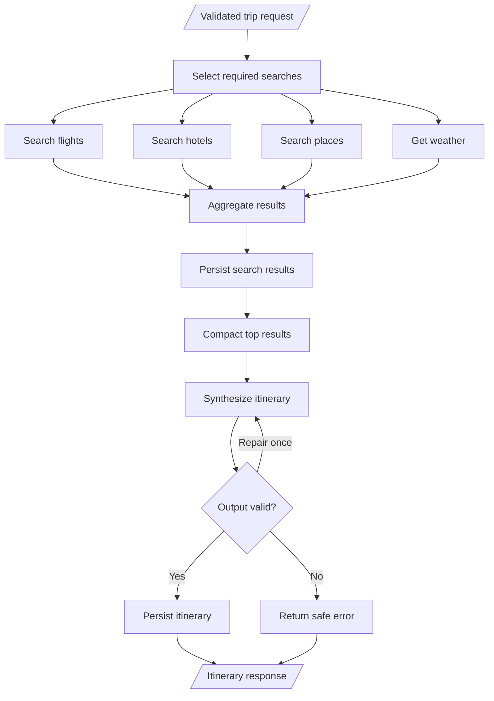
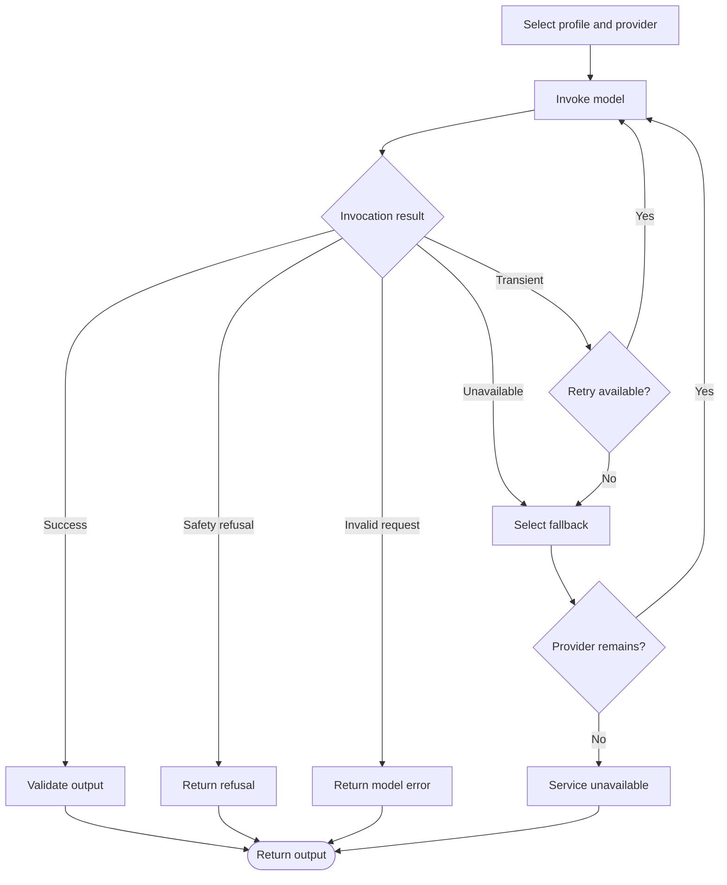

# LangGraph Design

## Goals

The graph must minimize unnecessary LLM calls, support missing-input pauses, isolate tool errors from model errors, resume safely after failure, and produce stable structured output for Flutter.

Authentication and WebSocket transport remain outside the graph. A request enters only after FastAPI has authenticated the session and validated the outer event envelope.

## Current implemented baseline

The current graph is a small bounded ReAct-style loop:

```text
START → invoke_model → route
                         ├─ final text → build_response → END
                         └─ tool calls → increment_tool_round → execute_tools → invoke_model
```

- Persisted bounded conversation history is converted to `HumanMessage` and `AIMessage` values.
- `FallbackModelGateway` tries configured providers in order: Groq, Google, then OpenAI.
- A model-provider exception, non-AI response, or response without text/tool calls moves to the next model provider. Task cancellation propagates and never triggers fallback.
- The final node accepts only a non-empty plain-text `AIMessage` and exposes it as `assistant_response`.
- The model can call registered `get_current_weather`, `search_flights`, `search_hotels`, `search_places`, and `convert_currency` tools. Only tools whose providers were initialized are registered, except weather, which is currently always initialized. `search_flights` accepts codes, airport names, or cities and resolves both endpoints concurrently in deterministic application code. Ambiguous results require user selection and are never guessed. The lower-level MCP `resolve_airport` tool remains available to deterministic backend workflows, but is not exposed separately to the model because flight search already performs that resolution.
- The prompt preserves misspelled or transliterated location substrings unchanged in the first tool call. Explicit `X se Y` direction remains origin-to-destination; provider results, rather than model spelling substitution, supply canonical locations. Multiple candidates continue through a normal clarification message in conversation history; durable graph interrupt/resume remains planned.
- `MAX_TOOL_ROUNDS` bounds tool execution; the default is two rounds. Expected provider errors become safe model-visible tool text.
- `TRAVEL_RESPONSE_TIMEOUT_SECONDS` applies one end-to-end deadline around graph execution and atomic reply persistence. Its default is 75 seconds, below the 120-second processing lease.
- The graph does not yet implement deterministic intent routing, fan-out, checkpoint-backed interrupts/resume, search persistence, or general structured Flutter result cards. Airport-selection guidance is extracted deterministically from validated flight tool messages and emitted as `travel.input.required`.

The implemented state is intentionally narrower than the target state below:

```python
class TravelGraphState(TypedDict):
    messages: Annotated[list[BaseMessage], add_messages]
    locale: str
    assistant_response: NotRequired[str]
    error_code: NotRequired[str]
    tool_rounds: NotRequired[int]
```

`ConversationProcessingService` remains outside the graph. It owns database leases and atomic message persistence; the graph never receives an `AsyncSession`, a WebSocket, API keys, or raw provider payloads.

## Target state contract

The initial state should be a typed mapping with compact, serializable values:

```python
class TravelGraphState(TypedDict):
    request_id: str
    user_id: str
    conversation_id: str
    request_type: str
    raw_input: str | None
    structured_input: dict
    intent: str | None
    missing_fields: list[str]
    validation_errors: list[str]
    model_profile: str
    provider_index: int
    retry_count: int
    tool_requests: list[dict]
    tool_result_ids: list[str]
    compact_results: dict
    search_id: str | None
    itinerary_id: str | None
    final_response: dict | None
    error_type: str | None
    error_message: str | None
```

Large provider payloads, secrets, HTTP clients, database sessions, and WebSocket objects must never be checkpointed. Persist large results first and keep identifiers plus compact top results in state.

## Target main graph



## Node responsibilities

### Input nodes

- `load_context`: loads a compact conversation summary, user preferences, and referenced trip metadata.
- `validate_request`: checks supported event version, input length, IDs, and request ownership assumptions.
- `extract_intent`: uses deterministic rules first and an economy model only when natural language remains ambiguous.
- `validate_slots`: validates travel dates, locations, travelers, rooms, currency, and configured result limits.

### Tool nodes

- `search_flights`
- `search_hotels`
- `search_places`
- `get_weather`
- `convert_currency`

Every tool node receives a validated domain request. It never receives arbitrary prompt text or user-selected URLs.

### Processing nodes

- `normalize_results`: enforces provider-independent response schemas.
- `rank_results`: applies deterministic ranking using explicit price, duration, distance, rating, and user filters.
- `aggregate_results`: joins independent itinerary branches.
- `compact_for_llm`: removes unused fields and limits each category before synthesis.

### Persistence nodes

- `persist_search`: stores the request and bounded offer snapshots idempotently.
- `persist_messages`: appends user-visible messages, not internal reasoning.
- `persist_itinerary`: stores a validated itinerary and items transactionally.
- `record_usage`: records provider/model, token, latency, fallback, and estimated cost metadata.

### Response nodes

- `request_user_input`: interrupts execution with stable missing-field codes.
- `build_structured_response`: creates Flutter card/list payloads without an LLM.
- `build_final_response`: validates synthesized itinerary output before returning it.
- `build_error`: maps typed internal errors to a public code and safe message.

## Target direct search subgraph

```mermaid
flowchart LR
    input[/"Validated search"/] --> call["Call MCP tool"]
    call --> outcome{"Tool outcome"}
    outcome -->|"Success"| normalize["Normalize"]
    outcome -->|"No results"| empty["Empty response"]
    outcome -->|"Transient"| retry{"Retry available?"}
    outcome -->|"Permanent"| failure["Provider error"]
    retry -->|"Yes"| call
    retry -->|"No"| failure
    normalize --> rank["Rank and limit"]
    rank --> save["Persist snapshot"]
    save --> output[/"Structured result"/]
    empty --> output
    failure --> output
```

No LLM participates in this path.

## Target itinerary subgraph

After validation, flight, hotel, places, and weather searches fan out independently. Required branches are selected from the request; a local trip may not need flights, and a day trip may not need hotels.



The synthesis node receives only validated preferences and compact normalized evidence. It cannot invent booking availability; each option retains its source, observed time, currency, and offer identifier.

## Target model gateway subgraph



Fallback must not run for malformed input, policy refusal, or an MCP/provider error. Each configured fallback model must support the same tool and structured-output contract.

## Interrupt and resume

This section is a target contract. The current compiled graph has no checkpointer or interrupt node.

Missing required fields produce an interrupt payload:

```json
{
  "type": "input.required",
  "request_id": "req_123",
  "fields": ["departure_date"],
  "message": "What date would you like to depart?"
}
```

FastAPI sends it over WebSocket. Flutter replies with the same `request_id`, and the graph resumes from its PostgreSQL checkpoint. Repeated resume payloads must be idempotent.

## Threading and concurrency

- `conversation_id` is the logical memory key.
- `request_id` is the invocation and idempotency key.
- MVP policy allows one active request per conversation.
- A newer request may explicitly cancel the active search before starting.
- Multiple conversations for one user may run independently.
- Checkpoint writes for a conversation must be serialized to prevent lost state.

## Bounded execution

Current bounds include conversation-history length, model attempts, per-provider timeout, one shared graph deadline, search-result count, WebSocket message size, and tool rounds. Token/provider budgets and repair-attempt controls are not implemented.

Every graph run has hard limits:

- maximum model attempts;
- maximum provider fallbacks;
- maximum tool calls per request;
- maximum repair attempts;
- maximum compact results per domain;
- maximum wall-clock duration;
- per-user token and provider-call budget.

When a limit is reached, the graph returns a structured partial or failure result; it does not loop indefinitely.

## Checkpointing

No LangGraph checkpointer is currently configured. The target production design uses `AsyncPostgresSaver` with a separate `langgraph` schema. Checkpoints support interrupts and recovery, but normalized application tables remain the durable business source of truth.

Current WebSocket generation runs in an in-process child task. Disconnect or shutdown cancels that task; the persisted assistant-run lease allows a later retry but does not resume execution from a graph checkpoint.
