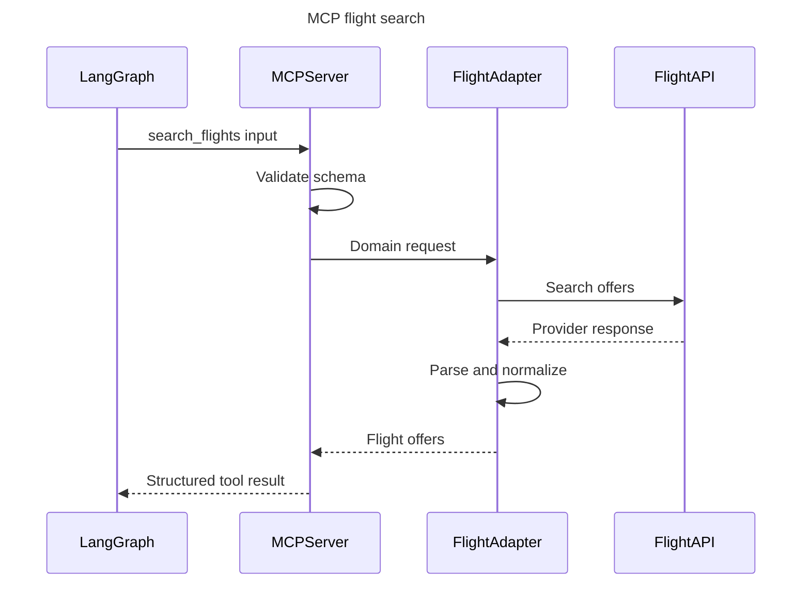

# MCP Server Design

## Role

The Travel MCP Server is the integration boundary between application workflows and external travel data providers. Tools expose stable, provider-independent schemas so the graph and Flutter contract do not change when a provider is replaced.

FastMCP currently runs inside the FastAPI process. `TravelMcpClient` invokes the server object directly, so no MCP HTTP route is mounted and Flutter cannot call MCP. `INTERNAL_MCP_PATH` is reserved for a future authenticated network transport.

## Tool catalog

| Tool | Purpose | LLM required? |
| --- | --- | ---: |
| `search_flights` | Search priced flight offers for validated travel dates and passengers. | No |
| `search_hotels` | Search available hotel offers for dates, rooms, guests, and budget. | No |
| `search_places` | Find attractions or activities by location and interests. | No |
| `get_current_weather` | Return current conditions for a city. | No |
| `convert_currency` | Convert a monetary amount using an observed exchange rate. | No |

Potential later tools include airport autocomplete, route estimates, offer refresh, and booking-related tools. Any tool that creates a booking, payment, or cancellation requires explicit user confirmation and a separate design review.

## Current provider matrix

| Capability | Implemented adapter | Runtime wiring |
| --- | --- | --- |
| Current weather | WeatherAPI | Always registered by the current lifespan. |
| Flights | Duffel | Registered when `FLIGHT_PROVIDER=duffel`. |
| Hotels | Duffel plus WeatherAPI location search | Registered when `HOTEL_PROVIDER=duffel`. |
| Places | Google Places plus WeatherAPI location search | Registered when `PLACES_PROVIDER=google`. |
| Places alternative | Tavily | Adapter exists, but lifespan registration is not implemented. |
| Currency | Frankfurter | Registered when `CURRENCY_PROVIDER=frankfurter`. |

## Tool contract principles

1. Inputs and outputs are typed Pydantic models.
2. Dates use ISO 8601 and timestamps include time zones.
3. Money is represented as decimal amount plus ISO currency code.
4. Provider names and offer IDs remain available for evidence and refresh.
5. Tools return structured errors; they do not hide failure in prose.
6. Results include `observed_at` and, where applicable, `expires_at`.
7. Tool descriptions are concise and state required fields and failure behavior.
8. User prompts cannot set arbitrary URLs, headers, API keys, result limits, or provider names.

## Example flight input

```json
{
  "origin": "LHE",
  "destination": "DXB",
  "departure_date": "2026-09-10",
  "return_date": "2026-09-17",
  "adults": 2,
  "children_ages": [8],
  "infants_with_seat_ages": [],
  "infants_on_lap_ages": [],
  "cabin_class": "economy",
  "currency": "PKR",
  "max_results": 5
}
```

## Example normalized flight offer

```json
{
  "offer_id": "internal_offer_id",
  "provider": "configured_provider",
  "provider_offer_id": "provider_offer_id",
  "total": {
    "amount": "215000.00",
    "currency": "PKR"
  },
  "segments": [],
  "refundable": null,
  "baggage_summary": null,
  "observed_at": "2026-08-11T10:00:00Z",
  "expires_at": "2026-08-11T10:10:00Z"
}
```

Unknown facts remain `null`; the tool must not infer them.

## Provider adapter boundary

```text
MCP Tool
  → Domain request
  → Provider interface
  → Concrete provider HTTP adapter
  → Raw provider response
  → Provider parser
  → Normalized domain response
```

Each domain defines a protocol such as `FlightProvider` or `HotelProvider`. Concrete adapters implement authentication, endpoints, pagination, provider-specific parameters, parsing, and rate-limit metadata.

## Tool call sequence



## Error taxonomy

Provider adapters currently normalize common configuration, authentication, rate-limit, timeout/unavailable, response-validation, and location errors through `app.common.exceptions`. The expanded taxonomy below is the target public contract; not every leaf type is implemented yet.

```text
TravelToolError
├── InvalidTravelInput
├── LocationNotFound
├── NoResults
├── ProviderRateLimited
├── ProviderUnavailable
├── ProviderAuthenticationFailed
├── ProviderResponseInvalid
├── OfferExpired
└── ToolTimeout
```

`NoResults` is normally returned as a successful empty result with explanatory metadata. Authentication failure and invalid provider response trigger alerts. Raw provider error bodies must be redacted before logging or tracing.

## Retry behavior

These bullets are the target retry policy. Current adapters use strict HTTP timeouts and generally do not perform application-level retry/backoff or circuit breaking.

- Validate before any provider call.
- Retry only transient connection, timeout, 429, or eligible 5xx failures.
- Respect `Retry-After` when present.
- Use bounded exponential backoff with jitter otherwise.
- Do not retry invalid credentials, malformed input, unsupported routes, or expired offers.
- Total retries must fit inside the graph request deadline.

LLM fallback is unrelated to travel-provider fallback. A failed flight API must not cause a switch from Groq to OpenAI.

## Normalization and ranking

MCP normalizes facts but does not apply user-specific final ranking. For example, it maps provider-specific segment fields into `FlightSegment`. The application ranking node then scores normalized results using user filters and deterministic rules.

The LLM must not calculate taxes, combine currencies, or decide that missing baggage/refund data exists. Such calculations belong in tested code.

## Persistence boundary

MCP tools are stateless with respect to users and trips. They do not write application tables. The graph receives normalized results, and an application service persists the bounded subset needed for history or itinerary construction.

Provider response caching may later live behind provider adapters, but it is infrastructure caching—not business persistence.

## Security

- API keys are injected into provider adapters from typed settings.
- Tool arguments are untrusted and size-limited.
- Provider URLs are configured, never user supplied.
- A future MCP network endpoint must validate service authentication and allowed origin/network policy.
- Logs include request/provider correlation IDs, never keys or authorization headers.
- Tool results are treated as untrusted external content before they enter an LLM prompt.

## Versioning

Adding optional fields is backward compatible. Renaming/removing fields, changing types, or changing semantics requires a new tool/schema version. Contract tests use sanitized provider fixtures to detect drift.
