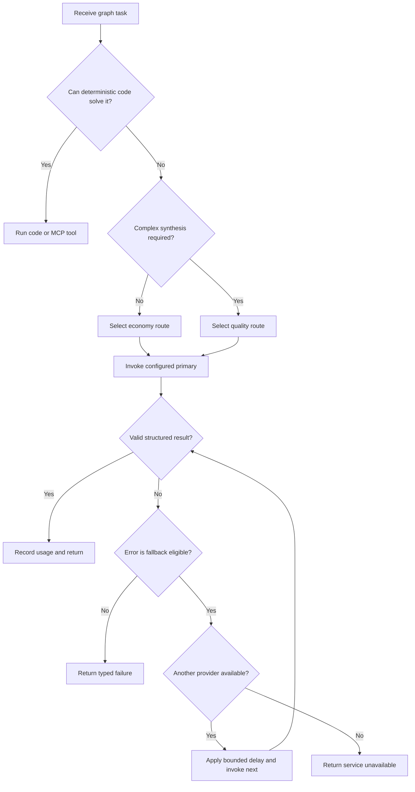
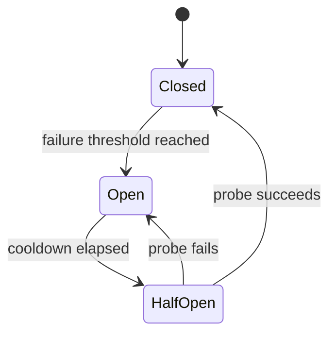

# Model Routing, Fallback, and Cost Control

## Goal

The model gateway selects the least expensive capable model, applies a controlled fallback policy, and records enough telemetry to evaluate quality and cost. Provider-specific SDK calls must stay behind this gateway so LangGraph nodes do not depend on one vendor.

Structured operations such as flight searches, hotel availability, weather lookup, arithmetic, authentication, and database queries should not use an LLM.

## Routing classes

| Route | Appropriate work | Behavior |
| --- | --- | --- |
| `none` | Validation, provider search, filtering, sorting | Deterministic code only |
| `economy` | Intent extraction, concise summaries, simple comparisons | Cheapest evaluated model first |
| `quality` | Multi-constraint itinerary synthesis or difficult repair | Stronger evaluated model chain |

The initial configurable model order is:

| Route | Primary | First fallback | Second fallback |
| --- | --- | --- | --- |
| Economy | `groq:openai/gpt-oss-20b` | `google_genai:gemini-3.5-flash-lite` | `openai:gpt-5.6-luna` |
| Quality | `google_genai:gemini-3.6-flash` | `openai:gpt-5.6-terra` | `groq:openai/gpt-oss-120b` |

Model identifiers and order belong in configuration, not business logic. Availability, pricing, tool support, and output quality must be verified before each production release.

## Decision flow

## Fallback eligibility

| Condition | Retry same provider | Try next model | Notes |
| --- | ---: | ---: | --- |
| Timeout or temporary network failure | Once | Yes | Respect the request deadline |
| Rate limit or exhausted provider quota | No | Yes | Open a temporary circuit |
| Provider 5xx or model unavailable | Once when safe | Yes | Use bounded exponential backoff |
| Invalid or malformed structured output | One repair attempt | Yes | Do not loop indefinitely |
| Invalid user input | No | No | Ask for or report missing input |
| Safety refusal | No | No | Preserve the refusal semantics |
| MCP or travel-provider failure | Provider policy | No | Changing the LLM cannot repair a tool outage |
| Authentication or configuration error | No | No | Alert operators; do not conceal it with fallback |

All retries and fallbacks share a single end-to-end deadline. A request must never receive a fresh full timeout for every provider.

## Stable model contract

Each route exposes one internal interface:

- A versioned system instruction.
- A constrained input context.
- A Pydantic output schema.
- A maximum completion size.
- A list of allowed tools, usually empty because LangGraph controls tool execution.
- Consistent error categories independent of provider.

Every configured fallback must pass the same structured-output and multilingual evaluation set before it is enabled.

## Token and cost controls

- Perform intent routing and parameter validation with deterministic code when confidence is sufficient.
- Send only the relevant trip state, not the entire database record or raw provider payload.
- Maintain a compact conversation summary and a small recent-message window.
- Limit provider results before synthesis: filter, deduplicate, rank, then pass only top candidates.
- Represent flight and hotel data as compact structured fields rather than prose.
- Set route-specific input and output token limits.
- Cache only safe deterministic or normalized results with explicit expiry; do not cache personalized prose blindly.
- Stop itinerary generation when the required schema is complete.
- Use the quality route only when a measurable quality benefit justifies it.

## Streaming behavior

If a provider fails after partial tokens have been shown, silently switching providers can duplicate or contradict text. For the first release:

- Stream lifecycle and tool-progress events immediately.
- Buffer the final model answer until its schema is validated.
- Emit only the successful final result.
- If token streaming is introduced later, define an explicit `response.restarted` event and replace semantics.

## Circuit breaker

Track failure state per provider and operation:

An in-process breaker is acceptable for one MVP instance. Use shared state, such as Redis, only when multiple instances require coordinated provider health.

## LangSmith telemetry

Attach non-secret metadata to every model run:

- Environment and application version.
- Graph name, node name, and prompt version.
- Route, provider, model, and fallback attempt.
- Input/output tokens, latency, and estimated cost.
- Schema-validation status and terminal error category.
- An anonymized user or session reference when needed for debugging.

Do not send access tokens, API keys, refresh tokens, raw payment details, or unnecessary personal data to traces. Use full tracing in development and sampled tracing in production, with higher sampling for errors and fallback events.

## Quality gates

Before changing a primary model or fallback order, compare it on a versioned evaluation dataset containing:

- Missing and contradictory trip constraints.
- Multiple cities with the same name.
- Dates, currencies, timezones, and overnight flights.
- No-result and partial-provider-result cases.
- English, Roman Urdu, and mixed-language prompts.
- Prompt-injection attempts inside provider content.
- Long conversations requiring summary-based context.

Promote a change only if required schema success, task quality, latency, and cost remain within agreed thresholds.
