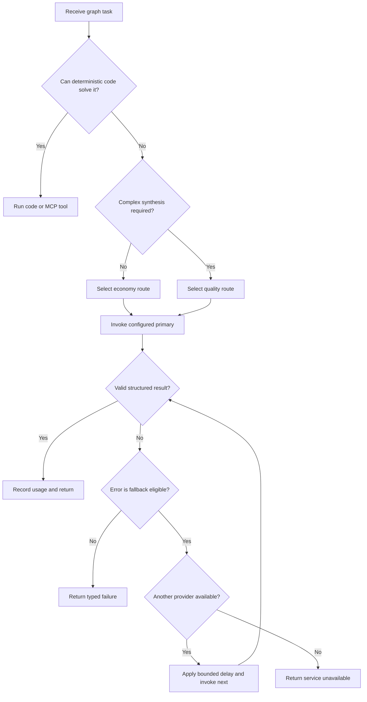
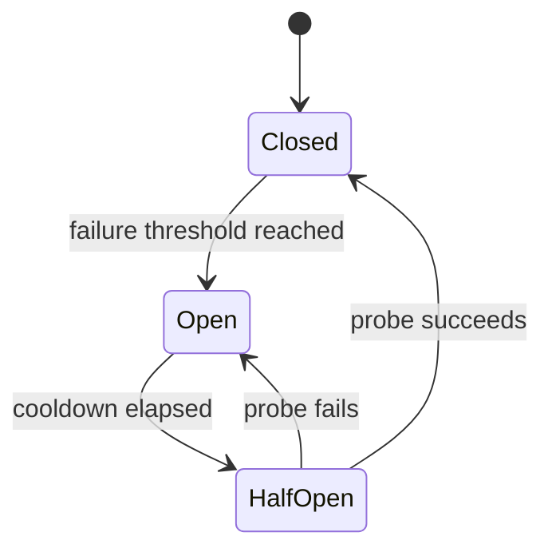

# Model Routing, Fallback, and Cost Control

## Goal

The model gateway selects the least expensive capable model, applies a controlled fallback policy, and records enough telemetry to evaluate quality and cost. Provider-specific SDK calls must stay behind this gateway so LangGraph nodes do not depend on one vendor.

Structured operations such as flight searches, hotel availability, weather lookup, arithmetic, authentication, and database queries should not use an LLM.

## Current implemented baseline

`FallbackModelGateway` is configured from server-side settings and uses this fixed cost-aware order when the corresponding API key is present:

```text
Groq → Google Gemini → OpenAI
```

Each provider client receives `MODEL_TIMEOUT_SECONDS`. Provider-local retries are disabled (`0`) because retry/fallback ownership belongs to the gateway; this prevents hidden repeated calls and keeps cost/latency bounded. The gateway returns the first non-empty `AIMessage` response or raises a safe `ModelGatewayError` after every configured provider fails.

Current configured model defaults are `openai/gpt-oss-20b` on Groq, `gemini-2.5-flash` on Google, and `gpt-4.1-mini` on OpenAI.

The current fallback catches every ordinary provider exception and gives each provider a full per-call timeout. It does not yet classify safety, invalid-input, authentication, quota, or transient errors. `TravelResponseService` now wraps graph execution and atomic reply persistence in a shared 75-second default deadline, so the former theoretical 270-second model path is cancelled before the 120-second assistant lease expires. Configuration also reserves a minimum 15-second margin for timeout/failure handling; see [Reliability and SPOF Review](reliability.md).

The current route is a single chat-response route. Provider fallback and correlated LangSmith tracing are implemented; economy/quality profiles and circuit breakers remain planned work.

## Routing classes

The classes and example model chains below are a target design, not implemented configuration.

| Route | Appropriate work | Behavior |
| --- | --- | --- |
| `none` | Validation, provider search, filtering, sorting | Deterministic code only |
| `economy` | Intent extraction, concise summaries, simple comparisons | Cheapest evaluated model first |
| `quality` | Multi-constraint itinerary synthesis or difficult repair | Stronger evaluated model chain |

The initial configurable model order is:

| Route | Primary | First fallback | Second fallback |
| --- | --- | --- | --- |
| Economy | `groq:openai/gpt-oss-20b` | `google_genai:gemini-3.5-flash-lite` | `openai:gpt-5.6-luna` |
| Quality | `google_genai:gemini-3.6-flash` | `openai:gpt-5.6-terra` | `groq:openai/gpt-oss-120b` |

Model identifiers and order belong in configuration, not business logic. Availability, pricing, tool support, and output quality must be verified before each production release.

## Decision flow



## Fallback eligibility

This table defines the target policy. The current gateway falls back on every caught `Exception`, other than task cancellation/system-level exceptions that are not `Exception` subclasses.

| Condition | Retry same provider | Try next model | Notes |
| --- | ---: | ---: | --- |
| Timeout or temporary network failure | Once | Yes | Respect the request deadline |
| Rate limit or exhausted provider quota | No | Yes | Open a temporary circuit |
| Provider 5xx or model unavailable | Once when safe | Yes | Use bounded exponential backoff |
| Invalid or malformed structured output | One repair attempt | Yes | Do not loop indefinitely |
| Invalid user input | No | No | Ask for or report missing input |
| Safety refusal | No | No | Preserve the refusal semantics |
| MCP or travel-provider failure | Provider policy | No | Changing the LLM cannot repair a tool outage |
| Authentication or configuration error | No | No | Alert operators; do not conceal it with fallback |

All retries and fallbacks must share a single end-to-end deadline. The outer graph deadline now enforces that invariant even though each individual model client retains its configured per-call timeout. Future routing should additionally pass the remaining budget to each provider for clearer telemetry and earlier rejection.

## Stable model contract

Each route exposes one internal interface:

- A versioned system instruction.
- A constrained input context.
- A Pydantic output schema.
- A maximum completion size.
- A list of allowed tools, usually empty because LangGraph controls tool execution.
- Consistent error categories independent of provider.

Every configured fallback must pass the same structured-output and multilingual evaluation set before it is enabled.

## Token and cost controls

- Perform intent routing and parameter validation with deterministic code when confidence is sufficient.
- Send only the relevant trip state, not the entire database record or raw provider payload.
- Maintain a compact conversation summary and a small recent-message window.
- Limit provider results before synthesis: filter, deduplicate, rank, then pass only top candidates.
- Represent flight and hotel data as compact structured fields rather than prose.
- Set route-specific input and output token limits.
- Cache only safe deterministic or normalized results with explicit expiry; do not cache personalized prose blindly.
- Stop itinerary generation when the required schema is complete.
- Use the quality route only when a measurable quality benefit justifies it.

## Streaming behavior

If a provider fails after partial tokens have been shown, silently switching providers can duplicate or contradict text. For the first release:

- Stream lifecycle and tool-progress events immediately.
- Buffer the final model answer until its schema is validated.
- Emit only the successful final result.
- If token streaming is introduced later, define an explicit `response.restarted` event and replace semantics.

## Circuit breaker

Circuit breakers are not currently implemented. The following is the target state machine.

Track failure state per provider and operation:



An in-process breaker is acceptable for one MVP instance. Use shared state, such as Redis, only when multiple instances require coordinated provider health.

## LangSmith and MCP telemetry

When `LANGSMITH_TRACING=true` and `LANGSMITH_API_KEY` is configured, the
application creates a fresh privacy-configured LangChain tracer for each LangGraph
execution. Only the LangSmith client is shared across requests, so completed-run
callback state does not accumulate over the worker lifetime.
The root run ID is the generated `trace_id`; `conversation_id` and
`client_message_id` are trace metadata. LangGraph propagates callbacks through
model calls and `StructuredTool` execution. The LangSmith client has both
`hide_inputs` and `hide_outputs` enabled, so prompts, chat history, tool arguments,
and tool results are not stored there. IDs and non-content run metadata remain
available for correlation. The database remains authoritative for conversation
history and audit records.

FastMCP's `on_call_tool` middleware observes the actual internal server execution.
It logs the tool name, outcome, and duration with the same three correlation IDs;
it never logs arguments or results. Context-local propagation keeps concurrent
WebSocket requests isolated. Graph, model-provider, and MCP measurements are
emitted as structured `application_metric` log records with low-cardinality
labels. Cloud Logging log-based counter/distribution metrics can use these records
for production dashboards and alert policies without placing IDs in metric labels.
Every provider attempt emits a counter and duration, including interrupted attempts.
An expired response deadline is recorded as `timeout`; external task cancellation
is recorded as `cancelled` and does not trigger a fallback provider. The same
deadline context is used for graph and MCP cancellation outcomes.
Graph metrics measure graph execution, not subsequent response persistence.

During shutdown the shared client's trace flush receives a two-second timeout.
Remaining traces may be dropped at shutdown; flush failures do not prevent the
WebSocket, HTTP, and database resources from being cleaned up.

Set the key through Secret Manager, set `LANGSMITH_PROJECT` to the intended
project, then enable `LANGSMITH_TRACING`. If tracing is enabled without a key,
startup logs a warning and continues without LangSmith. This does not affect
conversation persistence or request outcomes.

## Quality gates

Before changing a primary model or fallback order, compare it on a versioned evaluation dataset containing:

- Missing and contradictory trip constraints.
- Multiple cities with the same name.
- Dates, currencies, timezones, and overnight flights.
- No-result and partial-provider-result cases.
- English, Roman Urdu, and mixed-language prompts.
- Prompt-injection attempts inside provider content.
- Long conversations requiring summary-based context.

Promote a change only if required schema success, task quality, latency, and cost remain within agreed thresholds.
