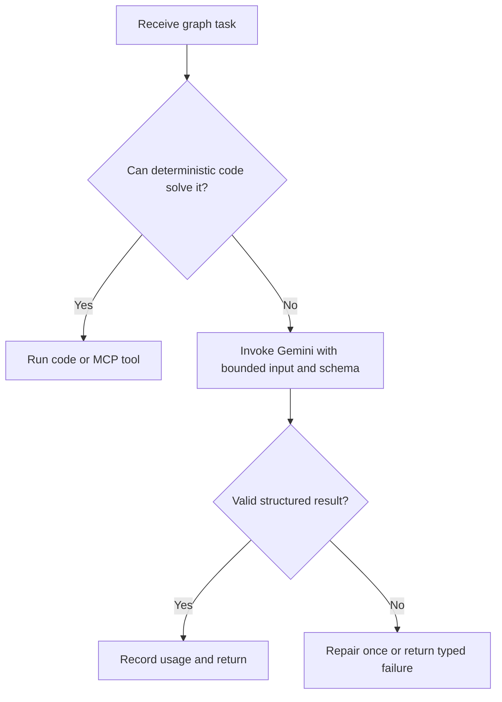
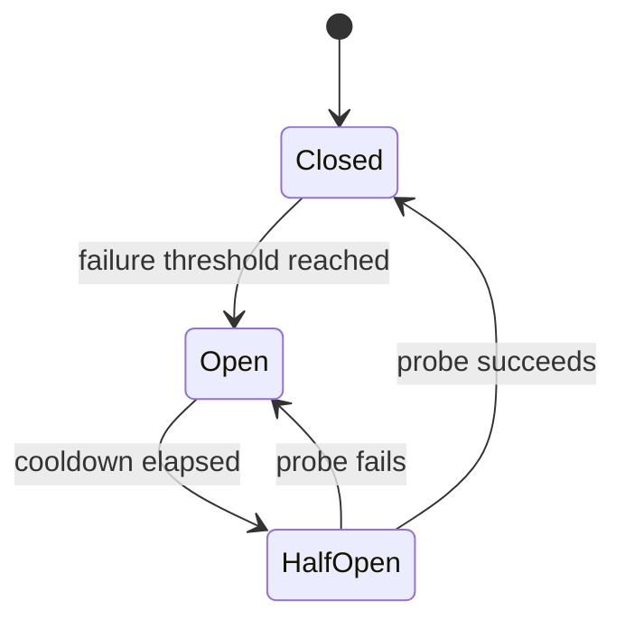

# Model Routing, Fallback, and Cost Control

## Goal

The model gateway selects the least expensive capable model, applies a controlled fallback policy, and records enough telemetry to evaluate quality and cost. Provider-specific SDK calls must stay behind this gateway so LangGraph nodes do not depend on one vendor.

Structured operations such as flight searches, hotel availability, weather lookup, arithmetic, authentication, and database queries should not use an LLM.

## Current implemented baseline

The runtime is configured for Google Gemini only. `build_model_gateway` creates one Gemini client using `GOOGLE_API_KEY`; the legacy `FallbackModelGateway` name remains as a shared gateway interface, but no cross-provider fallback occurs. SDK retries are disabled, model input and output are bounded, and the application applies a shared 75-second deadline to graph execution and atomic reply persistence. A missing Gemini key fails startup with a configuration error.

The active planner uses tool-free structured extraction and synthesis. Requirement extraction uses low reasoning effort to reduce latency; synthesis retains the configured model default. Gemini receives a simplified generation schema because the complete extraction schema was rejected by the configured endpoint with HTTP 400. The backend validates results against the original Pydantic schema and allows one bounded repair attempt. Provider errors become typed failures; they do not route to another model vendor. See [Reliability and SPOF Review](reliability.md).

## Routing classes

The following are design targets, not active runtime configuration.

| Route | Appropriate work | Behavior |
| --- | --- | --- |
| `none` | Validation, provider search, filtering, sorting | Deterministic code only |
| `economy` | Intent extraction, concise summaries, simple comparisons | A selected model with measured quality and cost |
| `quality` | Multi-constraint itinerary synthesis or difficult repair | A selected model with measured quality and cost |

Model identifiers, availability, pricing, tool support, and output quality must be verified before production changes.

## Decision flow

```mermaid
flowchart TD
    A[Receive graph task] --> B{Can deterministic code solve it?}
    B -- Yes --> C[Run code or MCP tool]
    B -- No --> D[Invoke Gemini with bounded input and schema]
    D --> E{Valid structured result?}
    E -- Yes --> F[Record usage and return]
    E -- No --> G[Repair once or return typed failure]
```

## Provider failure behavior

A single configured model vendor creates a model-service availability dependency. Gemini rate limits, outages, invalid credentials, or incompatible schemas can fail planning requests. The backend classifies these errors and surfaces a stable application failure. It does not retry against another vendor. SDK retries stay disabled to bound hidden repeated calls and latency.

| Condition | Runtime behavior |
| --- | --- |
| Timeout, network failure, 429, or 5xx | Return typed provider failure under the request deadline |
| HTTP 400/401/403/404/413/422 | Return typed provider/configuration failure |
| Safety refusal | Preserve refusal semantics; do not retry |
| Invalid structured result | Use the planner's single bounded repair, then fail safely |
| Invalid user input | Ask for missing or conflicting trip requirements |
| MCP or travel-provider failure | Handle within the affected travel tool; changing the LLM cannot repair it |

## Stable model contract

The gateway exposes a provider-independent interface with versioned prompts, bounded input, a Pydantic output schema, a maximum completion size, and consistent error categories. LangGraph controls tool execution; the current extraction and synthesis calls do not expose callable tools.

Every model or prompt change should pass the structured-output and multilingual evaluation set before release.

Gemini receives a simplified generation schema that preserves object structure, required fields, references, unions, enums, and extra-property restrictions. Defaults, titles, formats, patterns, and size or numeric bounds are omitted from the generation schema; the full extraction schema was rejected by the configured endpoint with HTTP 400. Results are validated against the original Pydantic model in the backend, with one bounded repair attempt. This schema projection does not weaken server-side validation.

## Implemented token and admission bounds

Every response has a 12-attempt provider budget. Model input text is limited to
120,000 characters and each provider's output cap defaults to 8,192 tokens.
PostgreSQL admission limits active generations to 16 globally and two per user,
with 100 admitted requests per user per UTC day. All limits except the fixed
12-attempt ceiling are configurable; see [planner configuration](langgraph.md).
These counters bound worst-case work and do not represent measured dollar spend.
Fresh matching research is reused within the conversation for five minutes.

## Additional token and cost targets

- Perform intent routing and parameter validation with deterministic code when confidence is sufficient.
- Send only the relevant trip state, not the entire database record or raw provider payload.
- Maintain a compact conversation summary and a small recent-message window.
- Limit provider results before synthesis: filter, deduplicate, rank, then pass only top candidates.
- Represent flight and hotel data as compact structured fields rather than prose.
- Set route-specific input and output token limits.
- Cache only safe deterministic or normalized results with explicit expiry; do not cache personalized prose blindly.
- Stop itinerary generation when the required schema is complete.
- Use the quality route only when a measurable quality benefit justifies it.

## Streaming behavior

If a provider fails after partial tokens have been shown, silently switching providers can duplicate or contradict text. For the first release:

- Stream lifecycle and tool-progress events immediately.
- Buffer the final model answer until its schema is validated.
- Emit only the successful final result.
- If token streaming is introduced later, define an explicit `response.restarted` event and replace semantics.

## Circuit breaker

Circuit breakers are not currently implemented. The following is the target state machine.

Track failure state per provider and operation:

```mermaid
stateDiagram-v2
    [*] --> Closed
    Closed --> Open: failure threshold reached
    Open --> HalfOpen: cooldown elapsed
    HalfOpen --> Closed: probe succeeds
    HalfOpen --> Open: probe fails
```

An in-process breaker is acceptable for one MVP instance. Use shared state, such as Redis, only when multiple instances require coordinated provider health.

## LangSmith and MCP telemetry

When `LANGSMITH_TRACING=true` and `LANGSMITH_API_KEY` is configured, the
application creates a fresh privacy-configured LangChain tracer for each LangGraph
execution. Only the LangSmith client is shared across requests, so completed-run
callback state does not accumulate over the worker lifetime.
The root run ID is the generated `trace_id`; `conversation_id` and
`client_message_id` are trace metadata. LangGraph propagates callbacks through
model calls and `StructuredTool` execution. The LangSmith client has both
`hide_inputs` and `hide_outputs` enabled, so prompts, chat history, tool arguments,
and tool results are not stored there. IDs and non-content run metadata remain
available for correlation. The database remains authoritative for conversation
history and audit records.

FastMCP's `on_call_tool` middleware observes the actual internal server execution.
It logs the tool name, outcome, and duration with the same three correlation IDs;
it never logs arguments or results. Context-local propagation keeps concurrent
WebSocket requests isolated. Graph, model-provider, and MCP measurements are
emitted as structured `application_metric` log records with low-cardinality
labels. Cloud Logging log-based counter/distribution metrics can use these records
for production dashboards and alert policies without placing IDs in metric labels.
Every provider attempt emits a counter and duration, including interrupted attempts.
An expired response deadline is recorded as `timeout`; external task cancellation
is recorded as `cancelled` and does not trigger a fallback provider. The same
deadline context is used for graph and MCP cancellation outcomes.
Graph metrics measure graph execution, not subsequent response persistence.

During shutdown the shared client's trace flush receives a two-second timeout.
Remaining traces may be dropped at shutdown; flush failures do not prevent the
WebSocket, HTTP, and database resources from being cleaned up.

Set the key through Secret Manager, set `LANGSMITH_PROJECT` to the intended
project, then enable `LANGSMITH_TRACING`. If tracing is enabled without a key,
startup logs a warning and continues without LangSmith. This does not affect
conversation persistence or request outcomes.

## Quality gates

Before changing a primary model or fallback order, compare it on a versioned evaluation dataset containing:

- Missing and contradictory trip constraints.
- Multiple cities with the same name.
- Dates, currencies, timezones, and overnight flights.
- No-result and partial-provider-result cases.
- English, Roman Urdu, and mixed-language prompts.
- Prompt-injection attempts inside provider content.
- Long conversations requiring summary-based context.

Promote a change only if required schema success, task quality, latency, and cost remain within agreed thresholds.
