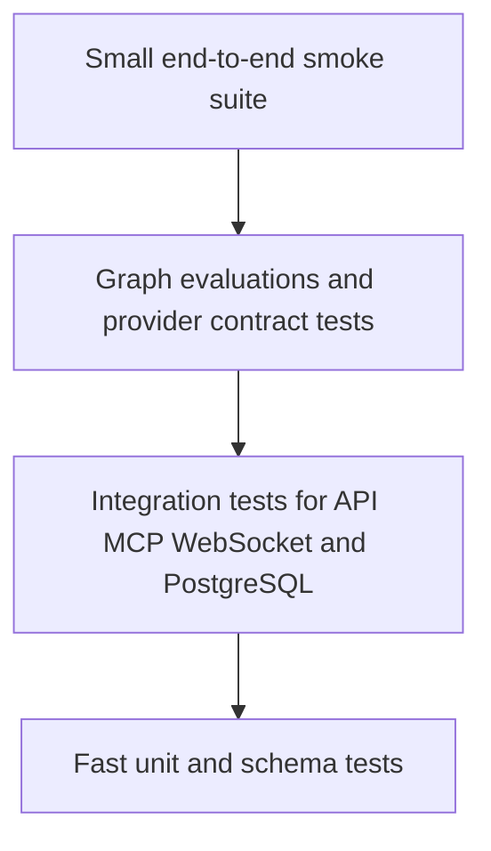
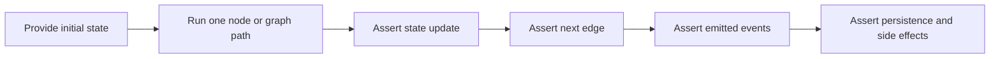
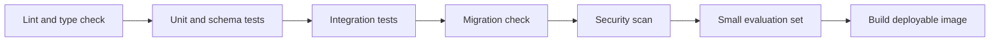

# Testing Strategy

## Goal

Testing must protect deterministic business rules, provider contracts, graph transitions, security boundaries, and travel-answer quality. Live provider calls are excluded from the default test suite because they are slow, costly, and nondeterministic.

## Test layers



The broadest layer contains the fewest tests. Most edge cases should be covered by fast deterministic tests.

## Current coverage boundary

The default suite has extensive unit and FastAPI/WebSocket integration coverage for authentication, persistence services, assistant-run leases, graph routing/tool execution, MCP schemas/tools, and provider mapping/HTTP behavior. External HTTP and model calls use fakes or `httpx.MockTransport`; live scripts under `scripts/` are manual checks and are not part of ordinary CI.

Most tests named `integration` still use dependency overrides, mocked sessions, or fake providers. An opt-in destination catalogue test now starts an isolated local PostgreSQL cluster, executes migrations, checks schema parity, and exercises real repository/service reads. Real LangGraph checkpoint/resume tests, provider circuit-breaker tests, load tests, a versioned LLM evaluation dataset, and end-to-end Cloud Run tests remain targets.

Run the real catalogue test by pointing to installed PostgreSQL binaries:

```bash
TEST_POSTGRES_BIN=/Library/PostgreSQL/18/bin uv run pytest tests/integration/database/test_destination_catalogue.py
```

Use the equivalent binary directory on other platforms. The fixture creates a
private temporary cluster and stops it after the test; it never reads application
database credentials or migrates an existing database. Without this variable the
test is skipped. Coverage includes populated upgrade/downgrade, legacy style
backfill, ORM/migration parity, more than 100 destinations/places, deleted cursor
anchors, ordered galleries, and SQL/Python ranking and Home/View All consistency.

## Unit tests

Cover pure and isolated behavior:

- Date, currency, timezone, passenger, and location validation.
- Search filters, ranking, deduplication, and price calculations.
- Provider payload normalization using recorded sanitized fixtures.
- Typed error mapping and retry eligibility.
- Model route selection and token-budget calculation.
- Authentication token hashing, expiry, and rotation rules.
- Itinerary ordering and conflict detection.

Freeze time where expiry or travel dates affect behavior.

## Schema and contract tests

- Validate every REST, WebSocket, MCP, and model-output example against its Pydantic schema.
- Verify protocol-version and event-name compatibility.
- Test providers with sanitized fixtures for successful, empty, partial, malformed, rate-limited, and unavailable responses.
- Keep a contract fixture for each provider API version in use.
- Fail clearly when a provider adds an unknown optional field; fail safely when a required field disappears.

## Integration tests

Target integration coverage should use an isolated PostgreSQL database and run real migrations. The current default suite does not require Cloud SQL.

Exercise:

- FastAPI request validation, authorization, and error envelopes.
- Login, refresh-token rotation, replay detection, logout, and session revocation.
- WebSocket authentication, commands, cancellation, reconnect, and idempotency.
- MCP tool registration and calls through the in-process boundary; add mounted transport tests only if a network MCP endpoint is introduced.
- LangGraph checkpoint save and resume behavior.
- Transaction rollback and database constraints.

External travel, weather, and LLM services should be replaced with controllable fakes at their adapter boundary.

### Current authentication coverage

The implemented authentication API has deterministic unit and FastAPI integration coverage for registration, login, refresh rotation, access-token authentication, current-device logout, logout-all, active-session listing, selected-session revocation, safe error envelopes, and request validation. Repository and service tests separately protect ownership filtering, transaction rollback, rotation, replay detection, and revocation behavior.

The default authentication API tests use dependency overrides and mocks, so they do not require Cloud SQL or consume external API/model quota. Real migration and PostgreSQL behavior belongs in a separate database-backed integration environment.

## LangGraph transition tests

Current tests cover the implemented model/tool loop, tool-round bounds, responses, and model fallback. The fan-out, interrupt, cancellation/resume, and checkpoint paths below are targets.

Test graphs as state machines, not only through final prose:



Required paths include:

- Complete request goes directly to search.
- Missing required fields produces one structured clarification.
- Flight, hotel, place, and weather searches run concurrently where safe.
- A partial provider failure still produces an explicitly partial result.
- Cancellation stops pending work and prevents a final success event.
- Resume continues from the stored checkpoint without duplicating provider calls.
- Retry bounds terminate instead of creating a graph loop.

## Model gateway tests

Current tests cover provider ordering, success, invalid responses, exception fallback, cancellation, tool binding, the shared graph deadline, failure persistence after timeout, and lease/deadline configuration. Error-classification-, circuit-, token-, and cost-aware cases below remain targets.

- Deterministic tasks never invoke a model.
- Economy and quality tasks select the configured route.
- Timeout, rate limit, and provider-unavailable errors fall back in order.
- Invalid input and safety refusal do not fall back.
- Total retries respect the end-to-end deadline and attempt limit.
- Invalid structured output receives at most the configured repair attempt.
- A successful fallback emits one final result and accurate usage metadata.
- Secrets and raw authorization data never appear in tracing metadata.

## Evaluation tests

No versioned model-quality evaluation suite is currently wired into CI.

Maintain a versioned dataset of representative travel prompts and expected structured facts. Include English, Roman Urdu, and mixed-language requests, plus adversarial and ambiguous cases.

Evaluate:

- Required-field extraction accuracy.
- Unsupported-assumption rate.
- Itinerary constraint satisfaction.
- Grounding in supplied provider results.
- Schema success and tool-selection accuracy.
- Latency, token use, and estimated cost.
- Safety and prompt-injection resistance.

Run a small deterministic evaluation set on every pull request and the full set before model, prompt, graph, or provider changes reach production. LangSmith may store evaluation runs, but the versioned dataset and acceptance thresholds should remain reviewable by the team.

## WebSocket edge cases

- Unsupported protocol version or event type.
- Duplicate command with the same idempotency key.
- Out-of-order client sequence number.
- Disconnect before acknowledgement and after acknowledgement.
- Reconnect while a run is active and after it finishes.
- Slow consumer, oversized message, heartbeat timeout, and server shutdown.
- Expired access token during a long connection.
- Two devices editing the same trip concurrently.

## Database tests

- Apply all migrations to an empty database and upgrade a representative previous version.
- Verify foreign keys, uniqueness, checks, and cascade behavior.
- Test concurrent refresh rotation and itinerary version updates.
- Confirm query plans for high-volume list and history queries.
- Verify retention and anonymization jobs on synthetic data.
- Perform a scheduled restore drill outside the ordinary CI suite.

## Security tests

- Authorization checks for every user-owned resource.
- Refresh-token replay, stolen-session revocation, and password brute-force limits.
- SQL injection, prompt injection through provider text, and malformed JSON.
- Secret redaction in logs, errors, traces, and test snapshots.
- Public rejection of internal MCP endpoints.
- Dependency and container-image vulnerability scanning.

## Performance tests

No automated performance/load suite or service-level objective gate is currently present.

Measure REST and WebSocket concurrency separately. Scenarios should include search fan-out, long-lived idle connections, reconnect storms, slow external providers, and database pool saturation. Use fake external providers with configurable latency and error rates so test traffic does not create API cost.

Set service-level targets before interpreting results. Track p50, p95, and p99 latency, error rate, active connections, memory per connection, database wait time, and model/provider spend per completed request.

## Continuous integration gates

The local pre-commit workflow currently runs Ruff formatting/linting and the Python test suite. Type checking, migration checks against a real database, secret/dependency/container scans, evaluations, and image builds should be added as the deployment pipeline matures.



A release should not proceed when a required test fails, a migration is unsafe, a secret is detected, or evaluation quality drops below its agreed threshold. Code coverage is useful for finding untested areas, but it is not a substitute for behavior-focused assertions.
