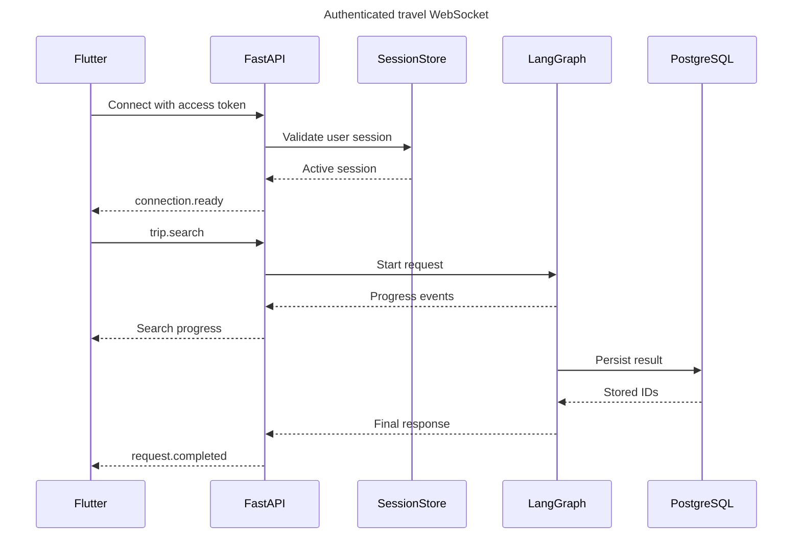

# WebSocket Protocol

## Purpose

WebSocket provides bidirectional, low-latency interaction for travel chat, progress updates, missing-input requests, cancellation, and incremental category results. REST remains the interface for login, token refresh, trip history, and ordinary resource CRUD.

Endpoint:

```text
wss://api.example.com/ws/travel
```

Local development may use `ws://127.0.0.1`, but every shared environment must use WSS.

## Current implemented protocol baseline

The current endpoint is `/ws/travel`. It accepts `connection.ping` and `travel.request` events. `travel.request` contains a `client_message_id`, optional `conversation_id`, message text, and locale.

For each accepted request the server sends `travel.request.accepted` immediately, then one of:

```text
travel.response.processing
travel.response.completed
travel.response.failed
```

`travel.response.completed` includes the persisted assistant message ID, content, and duplicate indicator. Public response failure codes are `provider_error`, `generation_failed`, and `attempts_exhausted`; no provider body, stack trace, token, or credential is sent to Flutter.

Response generation runs in a background task per accepted request. Each connection serializes outbound events with a per-connection send lock, so a slow model invocation does not block heartbeats or another inbound request. On disconnect, pending response tasks are cancelled and awaited; their assistant-run lease can later expire and be reclaimed safely.

The broader event names and request-ID contract documented below remain the target protocol for MCP search, interrupts, cancellation, and itineraries.

## Connection lifecycle



The access credential should be sent in the WebSocket handshake header on native Flutter. Long-lived refresh tokens must never appear in the URL. For clients unable to set headers, FastAPI may issue a single-use, short-lived connection ticket over authenticated REST.

## Envelope

Every client and server event uses a versioned JSON envelope:

```json
{
  "version": 1,
  "type": "flight.search",
  "request_id": "req_01J...",
  "conversation_id": "conv_01J...",
  "sent_at": "2026-08-11T10:00:00Z",
  "payload": {}
}
```

| Field | Requirement |
| --- | --- |
| `version` | Required protocol version. Unsupported versions are rejected. |
| `type` | Required registered event name. |
| `request_id` | Required idempotency/correlation ID generated by the client for new actions. |
| `conversation_id` | Required for chat/trip context; ownership is verified server-side. |
| `sent_at` | Client timestamp for diagnostics; server time remains authoritative. |
| `payload` | Event-specific typed object with size and field limits. |

## Client events

```text
chat.message
flight.search
hotel.search
places.search
weather.get
trip.plan
input.provided
request.cancel
connection.ping
```

Example structured flight request:

```json
{
  "version": 1,
  "type": "flight.search",
  "request_id": "req_123",
  "conversation_id": "conv_123",
  "sent_at": "2026-08-11T10:00:00Z",
  "payload": {
    "origin": "LHE",
    "destination": "DXB",
    "departure_date": "2026-09-10",
    "return_date": "2026-09-17",
    "adults": 2,
    "currency": "PKR"
  }
}
```

## Server events

```text
connection.ready
request.accepted
intent.detected
input.required
tool.started
tool.completed
search.partial
provider.fallback
request.completed
request.failed
request.cancelled
connection.pong
session.expired
```

All non-connection events include `request_id`. Ordered events include an integer `sequence` scoped to the request.

Example progress event:

```json
{
  "version": 1,
  "type": "tool.started",
  "request_id": "req_123",
  "conversation_id": "conv_123",
  "sequence": 2,
  "sent_at": "2026-08-11T10:00:01Z",
  "payload": {
    "tool": "search_flights"
  }
}
```

## Missing input

The server sends:

```json
{
  "version": 1,
  "type": "input.required",
  "request_id": "req_123",
  "conversation_id": "conv_123",
  "sequence": 3,
  "payload": {
    "fields": ["departure_date"],
    "message": "What date would you like to depart?"
  }
}
```

Flutter responds with `input.provided` and the same IDs. The graph resumes from its checkpoint. Unknown extra fields are rejected or ignored according to the event schema version, not forwarded into a prompt.

## Errors

```json
{
  "version": 1,
  "type": "request.failed",
  "request_id": "req_123",
  "conversation_id": "conv_123",
  "sequence": 4,
  "payload": {
    "code": "INVALID_RETURN_DATE",
    "message": "Return date must be after departure date.",
    "retryable": false
  }
}
```

Public error codes are stable. Stack traces, provider bodies, model errors, SQL details, and credentials never appear in client events.

## Idempotency

- The client creates a unique `request_id` for every new action.
- Replaying an accepted `request_id` returns current status or the stored terminal response.
- A duplicate event must not create a second provider search or database row.
- Persistence uses a unique constraint on `request_id` plus transactional upserts.
- `input.provided` is idempotent per interrupted step.

## Cancellation

`request.cancel` identifies the active `request_id`. FastAPI marks the run cancelled, stops cancellable graph work, ignores late results, persists terminal status, and returns `request.cancelled`. Provider requests that cannot be cancelled may finish in the background, but their results must not overwrite a newer request.

## Reconnection

Flutter reconnects with exponential backoff and re-authenticates. After reconnecting, it requests statuses for its active `request_id` values. Completed responses are read from PostgreSQL; active graph executions resume or report their current checkpoint status.

MVP does not promise replay of every transient progress message. Terminal results and durable user actions are replayable.

## Backpressure and limits

- Maximum envelope and prompt sizes are enforced before graph invocation.
- One active request per conversation is the MVP default.
- Per-user concurrent request and rate limits apply.
- Progress events may be coalesced when the client is slow.
- Provider result pages are bounded and loaded on demand.
- Idle sockets receive heartbeat checks and close after a configured inactive period without invalidating the login session.

## Observability

Every connection and event log includes safe correlation fields: `connection_id`, hashed `user_id`, `session_id`, `conversation_id`, and `request_id`. Message bodies and tokens are excluded from default logs. LangSmith metadata uses the same correlation IDs without raw personal data.
