# WebSocket Protocol

## Purpose

WebSocket currently provides authenticated travel chat, heartbeats, processing state, final responses, and structured airport clarification. Durable graph interrupts, explicit cancellation, incremental category results, trip history, and ordinary trip/conversation CRUD are target capabilities.

Endpoint:

```text
wss://api.example.com/ws/travel
```

Local development may use `ws://127.0.0.1`, but every shared environment must use WSS.

## Current implemented protocol baseline

The current endpoint is `/ws/travel`. It accepts `connection.ping` and `travel.request` events. `travel.request` contains a `client_message_id`, optional `conversation_id`, optional `trip_id`, message text, and locale. When `trip_id` is present, the server verifies ownership and persists that context on the user message before invoking the graph.

```json
{
  "version": 1,
  "type": "travel.request",
  "sent_at": "2026-08-28T10:00:00Z",
  "payload": {
    "client_message_id": "018f6f4e-5f43-7b14-91f4-f7f5412c9001",
    "conversation_id": "018f6f4e-5f43-7b14-91f4-f7f5412c9002",
    "trip_id": "018f6f4e-5f43-7b14-91f4-f7f5412c9003",
    "message": "Create a day-by-day itinerary for this trip",
    "locale": "en-PK"
  }
}
```

General travel chat omits `trip_id`. A missing or differently owned trip returns `travel.request.rejected` with `trip_not_found` without closing the socket. Reusing a `client_message_id` with a different trip context returns `client_message_conflict`.

For each accepted request the server sends `travel.request.accepted` immediately, then one of:

```text
travel.response.processing
travel.input.required
travel.response.completed
travel.response.failed
```

`travel.response.completed` includes the persisted assistant message ID, content, duplicate indicator, and a nullable `itinerary_id`. A non-null itinerary ID lets Flutter offer a deterministic **View itinerary** action and fetch the structured timeline from `GET /itineraries/{itinerary_id}`. Normal chat and search replies return `null`. Cached retries return the same generated itinerary ID. Public response failure codes are `provider_error`, `generation_failed`, and `attempts_exhausted`; no provider body, stack trace, token, or credential is sent to Flutter.

When flight airport resolution requires a choice, the terminal event is
`travel.input.required` instead of `travel.response.completed`. It includes the
persisted assistant message and typed airport requests. A request may contain
origin, destination, or both. `selection_required` has two through five options;
`not_found` has no options and asks for city plus country/region. Flutter sends
the selected code as a new idempotent `travel.request`; durable graph
`input.provided` resume is not implemented yet.

```json
{
  "version": 1,
  "type": "travel.input.required",
  "sent_at": "2026-08-29T10:00:05Z",
  "payload": {
    "client_message_id": "018f6f4e-5f43-7b14-91f4-f7f5412c9001",
    "conversation_id": "018f6f4e-5f43-7b14-91f4-f7f5412c9002",
    "assistant_message_id": "018f6f4e-5f43-7b14-91f4-f7f5412c9004",
    "content": "Select a London airport.",
    "is_duplicate": false,
    "clarification": {
      "type": "airport_selection",
      "requests": [
        {
          "field": "origin_airport",
          "query": "lindon",
          "status": "selection_required",
          "question": "Select an airport for lindon.",
          "options": [
            {
              "provider_location_id": "provider-location-id",
              "iata_code": "LON",
              "location_type": "city",
              "name": "London",
              "city_name": "London",
              "country_name": "United Kingdom",
              "country_code": "GB"
            },
            {
              "provider_location_id": "provider-stansted-id",
              "iata_code": "STN",
              "location_type": "airport",
              "name": "London Stansted Airport",
              "city_name": "London",
              "country_name": "United Kingdom",
              "country_code": "GB"
            }
          ]
        }
      ]
    }
  }
}
```

```json
{
  "version": 1,
  "type": "travel.response.completed",
  "sent_at": "2026-08-28T10:00:05Z",
  "payload": {
    "client_message_id": "018f6f4e-5f43-7b14-91f4-f7f5412c9001",
    "conversation_id": "018f6f4e-5f43-7b14-91f4-f7f5412c9002",
    "assistant_message_id": "018f6f4e-5f43-7b14-91f4-f7f5412c9004",
    "content": "I created a two-day itinerary draft for your trip.",
    "is_duplicate": false,
    "itinerary_id": "018f6f4e-5f43-7b14-91f4-f7f5412c9005"
  }
}
```

Response generation runs in a background task per accepted request. Each connection serializes outbound events with a per-connection send lock, so a slow model invocation does not block heartbeats or another inbound request. On disconnect, pending response tasks are cancelled and awaited; their assistant-run lease can later expire and be reclaimed safely.

The broader event names and request-ID contract documented below remain the target protocol for MCP search, interrupts, cancellation, and itineraries. Current idempotency uses `client_message_id`, not the target `request_id` envelope.

## Connection lifecycle

The following sequence is the target structured-search lifecycle. The current lifecycle uses `travel.request` and the response events listed above.

```mermaid
sequenceDiagram
    title Authenticated travel WebSocket
    participant Flutter
    participant FastAPI
    participant SessionStore
    participant LangGraph
    participant PostgreSQL

    Flutter->>FastAPI: Connect with access token
    FastAPI->>SessionStore: Validate user session
    SessionStore-->>FastAPI: Active session
    FastAPI-->>Flutter: connection.ready
    Flutter->>FastAPI: trip.search
    FastAPI->>LangGraph: Start request
    LangGraph-->>FastAPI: Progress events
    FastAPI-->>Flutter: Search progress
    LangGraph->>PostgreSQL: Persist result
    PostgreSQL-->>LangGraph: Stored IDs
    LangGraph-->>FastAPI: Final response
    FastAPI-->>Flutter: request.completed
```



The access credential should be sent in the WebSocket handshake header on native Flutter. Long-lived refresh tokens must never appear in the URL. For clients unable to set headers, FastAPI may issue a single-use, short-lived connection ticket over authenticated REST.

## Envelope

This is the target envelope. Current client events contain `version`, `type`, `sent_at`, and a typed payload; correlation lives in `client_message_id` and `conversation_id` inside the travel payload.

Every client and server event uses a versioned JSON envelope:

```json
{
  "version": 1,
  "type": "flight.search",
  "request_id": "req_01J...",
  "conversation_id": "conv_01J...",
  "sent_at": "2026-08-11T10:00:00Z",
  "payload": {}
}
```

| Field | Requirement |
| --- | --- |
| `version` | Required protocol version. Unsupported versions are rejected. |
| `type` | Required registered event name. |
| `request_id` | Required idempotency/correlation ID generated by the client for new actions. |
| `conversation_id` | Required for chat/trip context; ownership is verified server-side. |
| `sent_at` | Client timestamp for diagnostics; server time remains authoritative. |
| `payload` | Event-specific typed object with size and field limits. |

## Client events

The list below is target scope; currently only `connection.ping` and `travel.request` are accepted.

```text
chat.message
flight.search
hotel.search
places.search
weather.get
trip.plan
input.provided
request.cancel
connection.ping
```

Example structured flight request:

```json
{
  "version": 1,
  "type": "flight.search",
  "request_id": "req_123",
  "conversation_id": "conv_123",
  "sent_at": "2026-08-11T10:00:00Z",
  "payload": {
    "origin": "LHE",
    "destination": "DXB",
    "departure_date": "2026-09-10",
    "return_date": "2026-09-17",
    "adults": 2,
    "currency": "PKR"
  }
}
```

## Server events

The list below is target scope. Current server event names are documented in the baseline section.

```text
connection.ready
request.accepted
intent.detected
input.required
tool.started
tool.completed
search.partial
provider.fallback
request.completed
request.failed
request.cancelled
connection.pong
session.expired
```

All non-connection events include `request_id`. Ordered events include an integer `sequence` scoped to the request.

Example progress event:

```json
{
  "version": 1,
  "type": "tool.started",
  "request_id": "req_123",
  "conversation_id": "conv_123",
  "sequence": 2,
  "sent_at": "2026-08-11T10:00:01Z",
  "payload": {
    "tool": "search_flights"
  }
}
```

## Missing input

The generic checkpoint-backed interrupt/resume contract below is not implemented
yet. Airport choices currently use `travel.input.required` from the baseline and
continue through a new `travel.request`.

The server sends:

```json
{
  "version": 1,
  "type": "input.required",
  "request_id": "req_123",
  "conversation_id": "conv_123",
  "sequence": 3,
  "payload": {
    "fields": ["departure_date"],
    "message": "What date would you like to depart?"
  }
}
```

Flutter responds with `input.provided` and the same IDs. The graph resumes from its checkpoint. Unknown extra fields are rejected or ignored according to the event schema version, not forwarded into a prompt.

## Errors

```json
{
  "version": 1,
  "type": "request.failed",
  "request_id": "req_123",
  "conversation_id": "conv_123",
  "sequence": 4,
  "payload": {
    "code": "INVALID_RETURN_DATE",
    "message": "Return date must be after departure date.",
    "retryable": false
  }
}
```

Public error codes are stable. Stack traces, provider bodies, model errors, SQL details, and credentials never appear in client events.

## Idempotency

These are target rules. Today, `client_message_id` uniquely identifies a persisted user message, duplicate completed requests reuse the canonical assistant reply, and assistant-run leases coordinate processing.

- The client creates a unique `request_id` for every new action.
- Replaying an accepted `request_id` returns current status or the stored terminal response.
- A duplicate event must not create a second provider search or database row.
- Persistence uses a unique constraint on `request_id` plus transactional upserts.
- `input.provided` is idempotent per interrupted step.

## Cancellation

Explicit `request.cancel` is not implemented. Current work is cancelled when its WebSocket disconnects or the application shuts down.

`request.cancel` identifies the active `request_id`. FastAPI marks the run cancelled, stops cancellable graph work, ignores late results, persists terminal status, and returns `request.cancelled`. Provider requests that cannot be cancelled may finish in the background, but their results must not overwrite a newer request.

## Reconnection

Automatic status lookup and graph checkpoint resume are not implemented. Flutter can resend the same `client_message_id`: completed work is reused, processing work reports processing, and an expired/eligible failed lease may be reclaimed.

Flutter reconnects with exponential backoff and re-authenticates. After reconnecting, it requests statuses for its active `request_id` values. Completed responses are read from PostgreSQL; active graph executions resume or report their current checkpoint status.

MVP does not promise replay of every transient progress message. Terminal results and durable user actions are replayable.

## Backpressure and limits

Current controls include maximum message bytes, prompt length, heartbeat/idle timeouts, history size, tool rounds, and per-connection serialized sending. Per-user concurrency/rate limits, progress coalescing, and structured result pagination below are target work.

- Maximum envelope and prompt sizes are enforced before graph invocation.
- One active request per conversation is the MVP default.
- Per-user concurrent request and rate limits apply.
- Progress events may be coalesced when the client is slow.
- Provider result pages are bounded and loaded on demand.
- Idle sockets receive heartbeat checks and close after a configured inactive period without invalidating the login session.

## Observability

Every connection and event log includes safe correlation fields: `connection_id`, hashed `user_id`, `session_id`, `conversation_id`, and `request_id`. Message bodies and tokens are excluded from default logs. LangSmith metadata uses the same correlation IDs without raw personal data.
